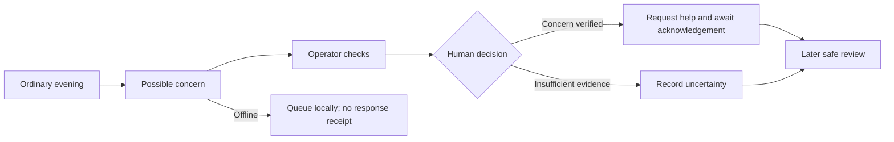
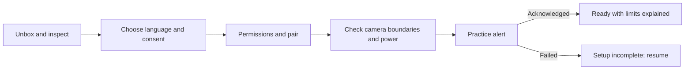
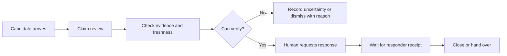
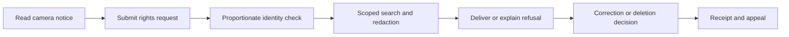
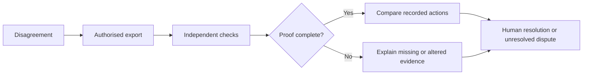
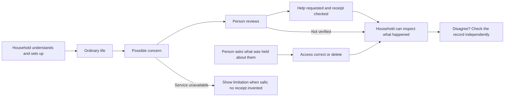

# User journeys and interface (C4, C3)

Everything below is a **proposed specification**, not an implemented screen. Screen IDs are stable contracts for design and frontend work. Numeric design targets are ASSUMPTIONS to verify on budget Android and with actual users. No emergency service is connected.

## 1. Five ordered flows

### A. Nomsa, ordinary night

1. Trigger: Nomsa previously enabled the service; S04 shows last checked protection state. She takes no action during suspected coercion.
2. Phone/edge input produces a candidate, not a finding about a person. Normal UI stays unchanged; event transport and duress equivalence remain unproven.
3. S08 receives a `sim_` candidate in rehearsal; operator opens S09, sees uncertainty and freshness, and checks available evidence.
4. Operator records a human decision; only a verified, authorised path may request response. Nomsa is not prompted to confront someone or secretly acknowledge an alert.
5. S10 tracks requested versus acknowledged response separately; S05 provides a later safe review. If disconnected, queue and disclose inability to reach a responder when safe; do not fabricate receipt.
6. Exit: human resolution or explicitly unresolved event, with an inspectable record. Safety is not guaranteed by detection.

### B. Household, installation day

1. Trigger: unbox proposed KHAYA; S06 checks serial and tamper condition. Householder or assisted installer chooses language on S01.
2. S02 explains data, recipients and withdrawal; household consent does not authorise looking into neighbours' private spaces.
3. S03 checks OS permissions; S06 pairs via local code and confirms camera boundaries, power and network with installer.
4. S07 sends an explicit practice alert; operator acknowledges it and householder sees the receipt.
5. Failure: remain “Setup incomplete” with exact missing item; no green protection badge from a timer. Installer can leave a paper support instruction.
6. Exit: S04 shows verified configuration and last contact, or incomplete setup that can resume offline.

### C. Operator, incident

1. Trigger: candidate in S08, deduplicated by event ID. Operator claims review with a versioned lease.
2. S09 exposes provenance, age and limitations; operator inspects lawful evidence, never a criminality label.
3. Human records reason and verification. Stale or insufficient data leads to “Cannot verify”, not default dispatch.
4. S10 requests response only after authority check; receipt from responder is a separate state. Sensitive system changes use a separate two-person approval flow.
5. Conflict/error: losing reviewer reloads current version; network retry reuses idempotency key. Timeout leaves status “Not acknowledged”.
6. Exit: close with reason and signed audit event, or hand over unresolved incident to next operator.

### D. Subject, request their file

1. Trigger: camera notice gives subject route S11; no subscription required.
2. Requester selects access/correction/deletion, approximate location and time. Avoid collecting a face image by default.
3. Staff use proportionate identity checks and match only within authorised scope; no public search by face or identity.
4. S12 shows receipt and status. Verified requester gets a redacted package and explanation; unrelated people remain protected.
5. Failure/contested identity: explain next step without confirming someone else's presence. Deletion checks legal holds and two-person approval; record limits and appeal route.
6. Exit: delivery, reasoned refusal, correction or confirmed deletion with backup expiry policy; escalation to information officer remains available.

### E. Dispute

1. Trigger: member, insurer and provider disagree; authorised requester selects record on S05.
2. Export manifest includes payload scope, signatures, keys, chain links, Merkle path and timestamp proof status.
3. Parties open verification view S12; check locally or with an independent verifier. A pending timestamp stays pending.
4. Compare system actions with the dispute. A valid commitment proves existence by a time, not truth of an accusation or compelled intent.
5. Failure: altered/missing payload, revoked key or missing proof yields explicit limitation; no blanket “valid record” badge.
6. Exit: parties receive verification result and may still disagree on meaning; legal adjudication is not automated.

## 2. First five minutes

Proposed seven in-app taps for an already provisioned service: (1) choose language; (2) continue after plain-language explanation; (3) explicitly agree to optional setup; (4) start device permission guide; (5) link pre-provisioned household; (6) send practice alert; (7) view acknowledgement and finish. Removed mandatory profile photo, marketing preferences, repeated tutorial and dashboard tour.

This is **not seven total taps to real protection**: Android system prompts, authentication, pairing, consent questions and hardware installation add variable actions. Do not hide them to satisfy the brief. Redesign uses assisted installation, saved progress and an OS-specific tap count measured on the actual phone. If unassisted end-to-end exceeds seven, report actual count and test whether further reduction is lawful and usable; never remove meaningful consent. Protection is not active until the service and response arrangement are verified. Target time five minutes excludes physical installation and is unverified.

## 3. Inventory and universal states

For every screen: loading = text “Checking…” with focus preserved; empty = “Nothing here yet” plus relevant next step; error = cause and safe retry; offline = local availability and unsent status; stale = last successful check timestamp; degraded = exactly which capability is unavailable. Never collapse these into green/red alone. Case-specific privacy exceptions for duress are below.

| Surface / screen | Purpose | Most important element | Never require |
|---|---|---|---|
| Member S01 Language | Comprehension | Native language choice | English literacy to choose |
| Member S02 Agreement | Informed setup | Recipients and withdrawal | Bundled marketing consent |
| Member S03 Device readiness | OS setup | Actual permission status | Blindly disabling phone security |
| Member S04 Home | Current service state | Last check plus limitation | Interaction during coercion |
| Member S05 Record | Review system actions | Action/time/proof distinction | Understanding cryptography |
| Household S06 Pair | Safe installation | Physical device confirmation | Cloud connection for local pairing |
| Household S07 Practice | End-to-end setup check | Real acknowledgement state | Mistaking practice for emergency |
| Operator S08 Queue | Triage | Age and reviewer ownership | Guessing stale event priority |
| Operator S09 Review | Human decision | Evidence uncertainty | Automatic guilt acceptance |
| Operator S10 Response | Follow through | Requested/received distinction | Assuming a sent request arrived |
| Subject S11 Rights | Access/correct/delete | No subscription required | Supplying unnecessary biometrics |
| Subject/shared S12 Receipt and proof | Follow request or verify export | Scoped status and limitations | Logging in to view someone else's data |

Additional specified screens: member account/recovery, contact preferences and safe logout; household camera-boundary calibration, membership/consent disagreement, maintenance and power status; operator two-person approvals, shift handover and role administration; subject identity-check/appeal and secure delivery. They inherit universal states and remain later wireframe work; twelve priority screens do not represent the complete implemented product.

## 4. Twelve wireframe specifications

Shared design assumptions: 360-pixel minimum design viewport, single column phone; desktop operator two panes collapses to one; 48-pixel touch targets; body 16 pixels, text scaling 200%; visible keyboard focus, labelled controls, screen-reader status announcements, no colour-only meaning. Use local fonts and no remote analytics. English copy below is source copy; isiZulu, Sesotho and Afrikaans require native-speaker review. All dates include timezone and all proof states use words.

1. **S01 Language.** Top VUKA wordmark; heading “Choose your language”. Full-width controls “English”, “isiZulu”, “Sesotho”, “Afrikaans”; selected option persists locally. Footer “Continue” enabled after selection; back retains choice. Loading/error use universal states; offline selection works. Screen reader speaks names in their language; no flag icons.
2. **S02 Agreement.** Heading “Know what is shared”. Three stacked sections: “Your chosen service receives alerts”; “Camera images stay on the device by design”; “You can ask for your information or leave”. Link “Read the full data notice”; checkbox “I understand and want to set up”; buttons “Agree and continue” and “Not now”. No preselection; agreement records notice version. “Not now” exits safely. Placeholder notice blocks real activation until approved; no claim embeddings are anonymous.
3. **S03 Readiness.** Heading “Set up this phone”. Status rows “Notifications”, “Background service”, “Connection to your household”; each exposes “Set up” for the OS-supported step. Footer “Check again”, “Continue later”. OS permission failure explains which function will not work; no loop demanding permission. No battery-optimisation bypass without explanation.
4. **S04 Home.** Header “Your household”; main card “Last checked: [time]” and factual service state; below “Practice alert”, “Your records”, “Settings”. Offline says “Phone has not reached the service since [time]”. No “You are safe” promise. Normal and duress variants must use the same layout, copy, focus and timing; **no duress badge**, notification, changed acknowledgement or status timing. This equality is a threat-model test target, not a promise. Public diagnostic status must not expose a hidden event.
5. **S05 Record.** Heading “What the service did”; chronological list “Received”, “Reviewed by a person”, “Response requested”, “Acknowledged”, “Closed” only when evidenced. Detail card separates event time, server receipt and proof confirmation. Buttons “Download my record”, “Ask a question”. Offline enables cached scoped records only. Missing payload: “Some information is no longer held”; never fabricate a reconstruction.
6. **S06 Pair.** Heading “Connect your household device”. Upper illustration placeholder for printed device code; “Scan code” and “Enter code”; serial confirmation then “This is my device”. Lower checklist “Camera view checked”, “Power checked”, “Household consent checked”, followed by “Test connection”. Scan is optional; expired code allows local reissue by physical access. Serial alone does not authorise remote takeover.
7. **S07 Practice.** Persistent “Practice alert — no emergency response” banner. Main “Send practice alert”; after activation “Waiting for practice acknowledgement”; only actual receipt shows “Practice received at [time]”. Buttons “Try again” with same request identity until resolved, “Finish setup” only on success, “Get setup help” on failure. Screen-reader announcements are polite; no flashing urgency.
8. **S08 Queue.** Header “Review queue”, connectivity and last refresh. Rows show event identifier, age, source and owner, never personal suspicion ranking as fact. Filters “Unclaimed”, “Mine”, “Unresolved”. “Review” obtains lease; conflict reads “Already being reviewed — refresh”. Desktop detail pane; phone opens S09. Empty: “No events awaiting review”; disconnected never says queue is empty.
9. **S09 Review.** Header candidate ID and source freshness; left evidence timeline, right “What is uncertain” and reviewer identity. Reason field mandatory. Buttons “Cannot verify”, “Dismiss with reason”, “Verify concern”; latter opens confirmation summarising action and scope. It does not itself dispatch or whitelist. Stale/conflicting data disables unsupported verification; retry does not erase reason. `watch_candidate` is technical state, user copy “Needs review”.
10. **S10 Response.** Heading “Response status”; locked reviewed summary, authorised destination, “Request response”. Timeline distinguishes “Request sent”, “Acknowledged by [service]”, “Closed by [operator]”. Actions “Record update”, “Hand over”, “Close with reason”. If request fails: “Not acknowledged — follow your response procedure”; never auto-switch recipient. Keyboard confirmation prevents accidental submission; no machine consequence from soft evidence.
11. **S11 Rights.** Heading “Ask about your information”; body “You do not need a subscription”. Options “See my information”, “Correct information”, “Request deletion”; location/time optional until staff explains need; safe contact method; “Send request” and privacy notice. Offline saves draft only with explicit device consent. Confirmation is generic to avoid confirming presence in footage. Accessible assisted route listed only after an actual staffed contact exists.
12. **S12 Receipt / proof.** Two purpose-specific tabs “My request” and “Check a record”, never mixing identities. Request view: reference, status, next action, “Provide requested information”, “Ask for review”. Proof view: local “Choose record package”, checks for content, signatures, chain and public timestamp individually, “Download check result”. Pending timestamp reads “Public proof pending”; deleted content says what cannot be checked. No upload by default. Identity failure never exposes matched subjects.

## 5. Accessibility and reality

One hand: bottom primary action, no precision swipe. Dark use: dim system-respecting theme, no flash; watched use: no hidden-mode cues, with packet/timing and notification tests required. Low literacy: short phrases, tested icons alongside words, assisted explanation with privacy. Translation: Lethabo recruits native reviewers; no unreviewed machine translation in consent. At 4% battery, show factual reduced availability and preserve local record/queue where possible; no promise of continuous sensing. With no data, pair locally and show unsent alerts. Older users need a reversible practice session and printed support path. Test with users, not just engineers.

## 6. Whole-product flow

Draw left to right: household setup → ordinary life → possible concern → human review → help request → later explanation. A lower lane carries subject rights and dispute checks. Every failure exits to “limitation visible / record retained where lawful”, never to a success icon.

## 7. Ten abandonment moments

| Moment | Design response |
|---|---|
| Unexplained permissions | Explain consequence before OS request |
| English-only consent | Reviewed language choices and assisted route |
| Setup eats data | Local pairing; disclose download size |
| False green status | Display actual receipt and last contact |
| Household argument about consent | Pause disputed capture; human resolution |
| Too many false alerts | Measure burden; review thresholds without concealing misses |
| Hard-to-reach controls | Large bottom actions and keyboard support |
| Hidden recurring charge | Price, renewal and cancellation before agreement |
| Rights request requires membership | Free nonmember route |
| No explanation after incident | Scoped record and staffed question path |

§11 check: all flows and twelve specs present; no implementation or duress guarantee; seven-tap conflict disclosed rather than hiding OS actions. Proceed to production. Human usability acceptance pending.
