# VUKA — System Architecture & Design

**Community safety you can verify.**

| | |
|---|---|
| **Document** | `docs/ARCHITECTURE.md` — the architecture description of record |
| **Version** | 1.1 |
| **Date** | 12 September 2026 |
| **Amendment** | v1.1 — security-incident disclosure generalised: specific services, files and line numbers withheld until rotation and history purge are complete |
| **Status** | Baselined for GKHack26 submission (25 August 2026) |
| **Supersedes** | `VUKA-Architecture.html` (summary view — retained as the presentation surface) |
| **Authority** | `CLAUDE.md` §3 locked decisions · `docs/adr.md` (append-only) |
| **Owners** | Builder A (architecture) · Builder B (backend/security) · Builder C (data science) |
| **Change control** | §2.8. Frozen contracts require three signatures and an ADR |

---

## Part 0 · How to read this document

### 0.1 What this document is

This is the **architecture description** for VUKA: the set of design decisions that are expensive to reverse. It is written to be *checked*, not admired. Every structural claim in it points at either a file in the repository, a numbered requirement in `docs/00-SPEC.md`, or a gap we have declared open.

It is deliberately longer than a pitch. A pitch persuades. An architecture description is a contract with the people who have to build, operate, audit and eventually replace the thing.

### 0.2 Who it is for

| Reader | Read | Skip |
|---|---|---|
| **Judge / evaluator** | Part I, Part II, Part VII, Part XII | Component tables |
| **New engineer, day one** | Part 0, I, II, III, then your layer | Business sections |
| **Security reviewer** | Part VI, VII, IX.1–IX.3, XII | Part XI |
| **Data protection reviewer** | Part VI, IX.2, VII.9 | Part IV |
| **Operator / partner** | Part I, IV, VIII, IX.4–IX.5 | Part V math |
| **Investor / partner exec** | Part I, XI.4, XI.5, XII | Everything else |

### 0.3 Status legend — used on every claim in this document

| Mark | Meaning | What you may assume |
|---|---|---|
| ✅ **BUILT** | Code exists, tests pass, in the repository today | It runs |
| 🔨 **BUILDING** | Under active construction this cycle, gate assigned | It will run by its gate |
| 📋 **SPECIFIED** | Designed and contracted, not implemented | It is a design, not a claim |
| 🧪 **SIMULATED** | Deliberately faked for demonstration, `sim_` prefixed in code | It is theatre, and we say so aloud |
| ⚠️ **OPEN GAP** | Known deficiency, published in `docs/OPEN-GAPS.md` | We found it before you did |
| ❌ **REFUSED** | Deliberately not built. Reason recorded in an ADR | Absence is a decision, not an omission |

> **The rule that governs this legend.** An unmarked claim is a defect in this document, and should be raised as one. `sim_` appears in the code *and* is said out loud in every demo — see `CLAUDE.md` D14.

### 0.4 Diagram conventions

| Convention | Meaning |
|---|---|
| **Solid arrow** | Synchronous call, caller blocks |
| **Dashed arrow** | Asynchronous, event, or response |
| **Dashed boundary** | Trust boundary — data crossing it changes its threat model |
| **🔒** | Signed or hashed at this point |
| **👤** | A human decision is required here. No code path bypasses it |
| **Colour** | 🔵 VIGIL · 🟠 KHAYA · 🟢 UMOJA · 🟣 ANCHOR |

### 0.5 The document set

| Document | Answers |
|---|---|
| **`docs/ARCHITECTURE.md`** — you are here | *How is it built, and why that way?* |
| `docs/SDLC.md` | *How do we build, test, ship, run and retire it?* |
| `docs/SDLC-GAP-ANALYSIS.md` | *What is still missing from the lifecycle, and what does it cost us?* |
| `docs/00-SPEC.md` | *What exactly must it do?* (F/N/E requirement numbers) |
| `docs/adr.md` | *Why did we decide that?* (append-only) |
| `docs/OPEN-GAPS.md` | *What is wrong with it right now?* |
| `docs/BUILD-LOG.md` | *What changed, when, by whom?* (append-only) |
| `CLAUDE.md` | *What may not be relitigated?* |

---

# PART I · THE ARCHITECTURE IN ONE PAGE

## 1.1 The system in one sentence

**VUKA is a four-layer community safety network whose every consequential decision is hashed, signed, batched into an hourly Merkle root and anchored to a public blockchain — so that any claim it makes about a person can be independently checked by someone who does not trust us.**

## 1.2 The binding constraint

Most safety technology is designed as though the constraint were **accuracy**. Build a better detector and the problem yields.

It is not the constraint. In South Africa the constraint is **legitimacy**.

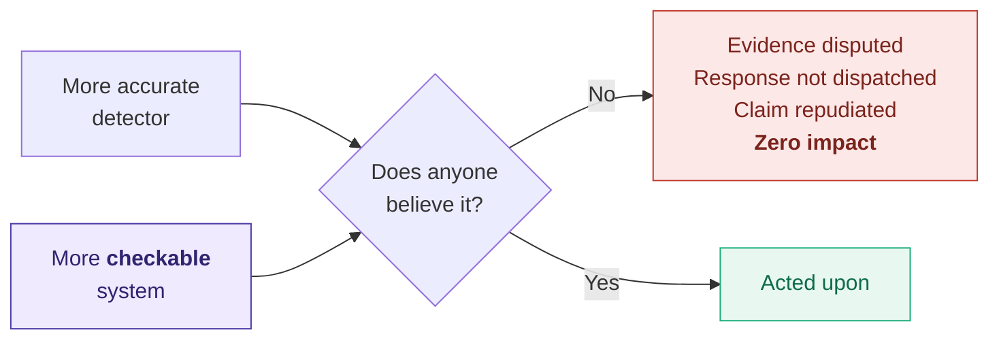

A detection nobody believes has no impact. A modest detection that a magistrate, an insurer, a community forum and the accused can *all independently verify* has enormous impact. So:

> **Every design decision in VUKA is required to make the system more checkable, not more capable.** Where the two conflict, checkability wins. §2.7 lists the six times that trade actually cost us something.

## 1.3 The problem, stated once

You cannot open a bank account in South Africa without installing the bank's app. The authentication factor and the asset now sit in the same object, in the victim's own hand, secured by a biometric that can be compelled by force.

The attack adapted to the architecture. Unlock. Open the app. Transfer. Then drive to an ATM for the daily limit.

**The victim performs the transaction. Every record the bank holds says they authorised it.**

Every existing safety product requires the user to *ask* — press a button, open an app, place a call. All of it needs a free hand and a moment of privacy.

**Coercion removes both.**

> ### You are not alone. You don't have to ask.

## 1.4 The four layers

VUKA is isiZulu for *wake up*. It is also the architecture.

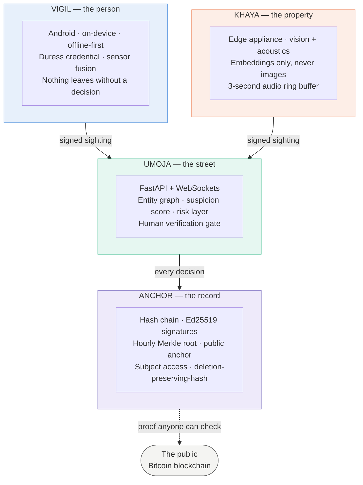

| Layer | Say it | Origin | Scope | Runs on |
|---|---|---|---|---|
| **VIGIL** | VIJ-il | Latin — *a watch kept through the night* | **The person** | Android phone, offline-capable |
| **UMOJA** | oo-MOH-ja | Swahili — *unity* | **The street** | Server (localhost + tunnel, or Azure) |
| **KHAYA** | KY-ah | isiZulu — *home* | **The property** | Edge appliance at the premises |
| **ANCHOR** | AN-ker | English | **The record** | Server-side, publishes to Bitcoin |

The layers are named for **the thing they protect**, not for the technology inside them. That is deliberate: a technology can then be replaced without renaming the architecture.

## 1.5 The property that is the whole point

Every safety company holds a database. When a dispute arises — *was the alarm raised at 22:41, or did you write that in afterwards?* — the database belongs to **one of the parties in the dispute**. It proves nothing to the other party. That is not a technology problem. It is a structural one, and no amount of database hardening fixes it.

VUKA publishes, every hour, a **32-byte number** to a blockchain that no participant in any future dispute controls.

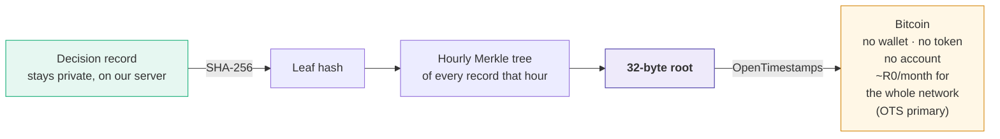

What that buys is **precedence**: proof that a record existed *before anyone had a reason to falsify it*.

It is important to be exact about what that is not:

| It **is** | It is **not** |
|---|---|
| Proof the record existed at time T | Proof the record is *true* |
| Proof it has not changed since | Proof the detection was correct |
| Checkable by a stranger with no access to us | ❌ "court-admissible" — we do not make that claim |
| Checkable in ten years, after we are gone | ❌ "immutable" — the *record* is deletable; the *hash* is not |

> **It forgets you. It never forgets what it did.**

## 1.6 What this system refuses to do

An architecture is defined as much by its refusals. These are enforced in code, not in policy, and each is recorded in an ADR.

| ❌ Refused | Why | Where recorded |
|---|---|---|
| Let any code path set `flagged` | NIST FRVT demographic false-positive differentials reach ~2 orders of magnitude. A machine may propose; only a named human may accuse | ADR-0002 · D6 · E1 |
| Store a face image | Embeddings only. Enforced in the vision layer so a policy change cannot silently weaken it | D7 · E2 |
| Persist raw audio | 3-second ring buffer, overwritten. There is no code path that writes it to disk | D7 · E3 |
| Put personal data on chain | Only a hash of a hash leaves the building. Ever | D9 · E4 |
| Use a generative model in any determination about a person | "The invention is unfalsifiable from the output" | ADR-0007 · D12 · E5 |
| Auto-dispatch a response | Total autonomy in perception. Zero autonomy in consequence | D13 |
| Unlock a gate, emit a blinding light, deploy a chemical agent, or announce a fake dispatch | Each is a criminal act, an assault, or an incitement — performed by a machine | `11-VUKA-AI-Autonomy.md` · D13 |
| Pay a responder bounty | It creates a financial incentive to escalate | D13 |
| Let one operator whitelist an entity alone | A whitelisted entity accumulates **no** suspicion, ever. This is the highest-value insider attack in the category | D10 · ADR-0022 |
| Sell a street-level risk score as an underwriting signal | That is redlining. Cut on 18 August 2026 | `15-VUKA-Gauntlet-Verdict.md` §2.3 |
| Run the whole thing on a permissioned chain | The parties to the dispute would be the validators | D11 · ADR-0021 |

---

# PART II · DESIGN PROCESS & SYSTEMS DESIGN APPROACH

> This part answers *how the architecture was arrived at*, not what it is. It is the part most architecture documents omit, and it is the part that tells you whether the rest can be trusted.

## 2.1 The lifecycle model: spec-driven and gate-sequenced

We do not run concurrent sprints. Concurrent sprints across seven people produce parallel half-features and one integration crisis. We run **one gate at a time, the whole team on it**.

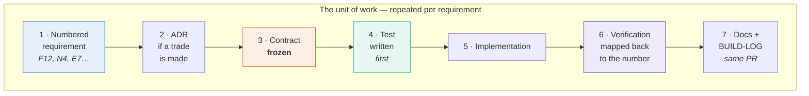

**Two rules make this more than a diagram:**

1. **Nothing is built that no requirement asks for.** If there is no F-number, there is no branch.
2. **Nothing is claimed that no test verifies.** If there is no test ID in the verification map, the status legend may not say ✅ BUILT.

### Why not agile sprints

| | Sprints | What we do |
|---|---|---|
| Unit of commitment | A time-box | A numbered requirement |
| What "done" means | Demo-able | Verified against the requirement, docs updated |
| Failure mode | Velocity theatre — a burndown that measures effort, not truth | Slower. A requirement can block for days |
| Why we chose ours | — | **The deliverable is a trust claim. A trust claim that is 80 % verified is 0 % verified** |

### Why not waterfall

We freeze **contracts** early, not **implementations**. The contract — `shared/contract.ts`, the API surface, the evidence-chain entry shape — is frozen so seven people can work without blocking on one another. Everything behind the contract stays soft and is rewritten freely. Several of the twenty-five ADRs are supersessions: the design moved, and the record shows exactly when and why.

## 2.2 The gate model

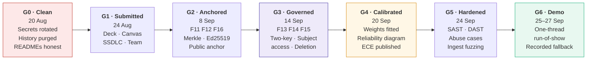

Each gate has **entry criteria, exit criteria and a named owner** — set out in `docs/SDLC.md` §2. A gate does not close because the date arrived. It closes because its exit criteria are evidenced.

> **G3 matters most and is the least glamorous.** It closes the POPIA gap we ourselves recorded in ADR-0006. A system that cannot show a person their own file has no business making claims about them.

## 2.3 The design method: constraint-first, adversary-inclusive

This is the actual method, in the order it is applied.

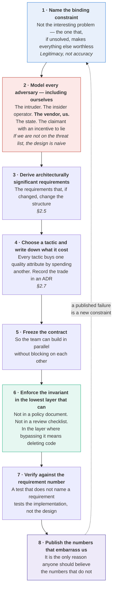

### Step 6 deserves its own note, because it is the load-bearing one

> **Privacy at the source.** An invariant is enforced in the lowest layer that *can* enforce it, so that a **policy** change cannot silently weaken it.

Worked example. "We do not store face images" can live in three places:

| Where the rule lives | What it takes to break it | Verdict |
|---|---|---|
| A privacy policy | An edit to a Word document | Worthless |
| A code review checklist | A distracted reviewer on a Friday | Weak |
| **The vision layer returns a 512-float vector, and there is no code path from the frame buffer to disk** | Deleting a function and writing a new one — in a PR, in front of two other people, against a test that asserts the absence | ✅ This is the one we use |

The same reasoning produces the 3-second audio ring buffer (E3), the human gate (E1) and the two-of-two signature (D10). In each case the question asked was not *"what should the rule be?"* but *"where must the rule live so that changing it is visible?"*

## 2.4 The design chain — worked end to end

Every significant element of VUKA can be traced along the same six-link chain. Here is the most important one in full.

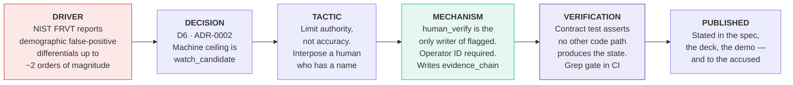

Note what the tactic is *not*. The obvious response to a biased face matcher is **"get a better face matcher."** We rejected that: a better matcher still has a differential, it just moves. The architectural response is to **remove the machine's authority to conclude** — which is robust to the matcher being bad, and stays true when someone swaps the model out in two years.

> **This is the shape of every good decision in this system: change what the machine is *allowed to do*, not how confident it is.**

## 2.5 Architecturally significant requirements

An ASR is a requirement that, if it changed, would change the *structure* — not just the code. These are the ones that earned an architecture.

| ASR | Requirement | Structural consequence | Ref |
|---|---|---|---|
| **ASR-1** | A person must be able to obtain the full record of decisions made about them, with a proof a stranger can check | Forces a separate ANCHOR layer, an append-only chain, and a subject-access API. It is why the record is a *chain* and not a table | F14 · D8 |
| **ASR-2** | No machine may accuse a person | Forces a state machine with a hard human boundary, and an operator identity system | F7 · D6 |
| **ASR-3** | The phone must work with no network, no signal, no server | Forces on-device inference, an offline queue, local-first fusion, and a degradation contract per layer | N3 · D2 |
| **ASR-4** | Detection → alert render ≤ 2.0 s p95 | Forces INT8 on-device models ≤ 20 MB, WebSocket fan-out rather than polling, and lazy-decay scoring at read time rather than a scheduler | N1 |
| **ASR-5** | The user must be able to signal under coercion with no observable difference | Forces the duress credential to be indistinguishable in **UI, network traffic and timing** — a cross-cutting constraint touching three layers | F3 |
| **ASR-6** | Biometrics must never be stored as images; audio must never be persisted | Forces the privacy boundary into the vision and audio layers, not the API layer | E2 · E3 · D7 |
| **ASR-7** | One operator must not be able to disable protection alone | Forces multi-party signatures into the write path, and therefore a key-management design | D10 |
| **ASR-8** | On-chain cost must not scale with users | Forces Merkle batching. This is what makes the economics work at any network size | D9 |
| **ASR-9** | Any probability shown to a human must be calibrated, or explicitly labelled a target | Forces a calibration layer between every model and the fusion stage. A raw softmax entering fusion is a **correctness bug**, not a style issue | N7 |
| **ASR-10** | The system must degrade — never blank, never invent | Forces every layer to define its behaviour when the layer above disappears, and forces stale data to carry a staleness marker | N5 |

## 2.6 Quality attribute scenarios

ATAM-style. Each scenario is testable, and each names the tactic that satisfies it.

| # | Source | Stimulus | Environment | Response | **Measure** | Tactic | Status |
|---|---|---|---|---|---|---|---|
| **QA-1** | Assailant | Forces victim to unlock phone | Under coercion, in public | Duress PIN unlocks identically; silent signal raised | **Zero** observable difference in UI, packet size or timing | Indistinguishable-path design | 📋 SPECIFIED |
| **QA-2** | Camera | Person detected at premises | Normal operation | Alert rendered on operator screen | **≤ 2 000 ms p95** — measured **318 ms**, n = 10 | Edge inference + WS fan-out | ✅ BUILT |
| **QA-3** | Network | Total connectivity loss | Load-shedding, stage 6 | Phone continues detecting and queues | **100 %** of local function retained; queue replayed in order | Offline-first, local queue | ✅ BUILT |
| **QA-4** | Accused person | Requests their own record | Any time | Full decision history + verifiable anchor proof | **≤ 30 days** statutory; target same-day, machine-checkable | Append-only chain + Merkle proof | 🔨 BUILDING · G3 |
| **QA-5** | Insider operator | Attempts to whitelist an entity alone | Authenticated, legitimate session | Action refused; the attempt is itself anchored | **0** single-signature whitelists possible | Two-of-two signature | 🔨 BUILDING · G3 |
| **QA-6** | Auditor | Asks "was this record altered?" | Ten years later, company gone | Independent verification without our cooperation | **Verifiable with public tools only** | Public anchor, no vendor dependency | 🔨 BUILDING · G2 |
| **QA-7** | Two sensors | Give contradictory evidence | Noisy, real conditions | Escalation is **suppressed** and routed to a human | K above `conflictK` ⇒ no auto-escalation, 100 % of cases | Conflict coefficient | ✅ BUILT |
| **QA-8** | Resident's own car | Arrives home nightly for 90 days | Normal operation | Accumulates **zero** suspicion | Whitelist short-circuit returns before any factor runs | Whitelist-before-watchlist | ✅ BUILT |
| **QA-9** | Attacker | Replays a captured sighting payload | Hostile network | Rejected on signature and nonce | **0** accepted replays | Device signature required on ingest | 🔨 BUILDING |
| **QA-10** | Operator | Views a risk figure for a cell with no data | Sparse-data suburb | Shown `no_data`, not a number | **Never** an invented value | Three-tier honest fallback | ✅ BUILT |

## 2.7 The six trade-offs we made — and what each cost

An architecture without stated costs is a sales document. These are real, and all six are live.

| # | We chose | We gave up | The cost, stated plainly |
|---|---|---|---|
| **T1** | **Checkability over capability** | Features that would demo better | We cannot say "our AI identifies criminals." We say "our AI proposes; a named human decides." It is a weaker sentence and a stronger system |
| **T2** | **Public chain over permissioned chain** | Sub-second finality, throughput, and a governance story enterprises find familiar | Anchoring is *hourly*, not instant. A record created at 14:05 is not anchored until 15:00. We accept a one-hour precedence window, because the alternative — validators who are parties to the dispute — defeats the purpose (D11) |
| **T3** | **Android only** | Roughly half the premium addressable market | iOS does not permit a persistent foreground service at the depth VIGIL needs. We would rather do one platform honestly than two badly. Budget Android is also the actual majority of the market we serve |
| **T4** | **A human gate on every accusation** | Response latency, and the ability to scale operators sub-linearly with cameras | An operator is now in the critical path for every escalation. That is an operating cost that grows with the network, and it is on the P&L. It is the price of not harming an innocent person |
| **T5** | **Embeddings only, no images** | Forensic review, retraining on our own data, and the ability to show a human "the face" | We cannot improve our matcher on production data. We cannot hand an investigator a photograph. Both are real losses, accepted — and the second is also a feature: we cannot be compelled to produce what we do not hold |
| **T6** | **Publishing our failures** | The cleanest possible pitch | Our forecast **loses to a constant baseline** — MAE 0.484 vs 0.246, n = 654 — and it is in the repository, on a slide, and in §12.2 of this document. It costs us the "AI-powered prediction" line. It buys the only thing that makes the rest of our numbers worth reading |

## 2.8 Decision governance

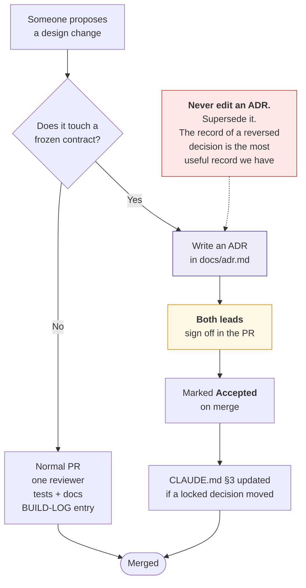

**What is frozen** — change requires three signatures and an ADR: the API surface in Appendix A · the state machine in §4.8 · the evidence-chain entry shape in Appendix B · `shared/contract.ts` · the privacy invariants E1–E5.

**What is deliberately not frozen**: every model, every threshold, every weight, the database engine, the map library, the UI. These are expected to change, and the architecture is built so that they can.

## 2.9 Roles and ownership

Seven builders across four universities. Two joint leads, both of whom also carry build tasks. Full roster in `docs/TEAM.md`.

| Builder | Owns | Named accountability |
|---|---|---|
| **Lethabo Hoaeane** · UNISA · *co-lead* | `docs/00-SPEC.md`, `app/`, `brain/`, the model manifest, UX | The architecture is coherent; the phone works offline |
| **Sibusiso Khumalo** · Wits · *co-lead* | `server/`, `anchor/`, `shared/contract.ts`, CI, demo orchestration. **Nitpicks feasibility on every spec — flags anything infeasible *today*, in an ADR proposal, not later** | Nothing ships that cannot run; the chain verifies |
| **Mutarisi Chibaya** · Pretoria | `dashboard/`, member-facing screens | The operator can act in one screen; the member is never shown an ops event |
| **Vukosi Khoza** · Wits | `appliance/` — sensors, edge runtime, power budget, tamper | The appliance survives a power cut and says so |
| **Ipeleng Constance Modise** · TUT | `docs/07-SECURITY.md`, threat model, OWASP mapping, physical security | Every control has a test, and the insider is modelled as an adversary |
| **Khutso Mothopa** · Wits | Requirements, work breakdown, traceability, `docs/06` | Every requirement maps to the test that verifies it |
| **Babatunde Adelusi** · Pretoria | `docs/08`, unit economics, go-to-market, the presentation | Every number published is defensible, and the estimates are marked as estimates |

**Escalation.** Lethabo oversees Mutarisi, Ipeleng and Babatunde; Sibusiso oversees Vukosi and Khutso. Both leads review everything. Anything touching a frozen contract or a locked decision goes to both.

**RACI on architectural decisions** — full matrix in `docs/SDLC.md` §3.

| Decision class | Lethabo | Sibusiso | Owner of the area |
|---|---|---|---|
| Layer boundaries, contracts | **R/A** | C | C |
| Cryptographic design | C | **R/A** | I |
| Calibration and thresholds | C | I | **R/A** |
| Interface and flow of use | **R/A** | I | **R** — Mutarisi |
| Security controls and threat model | C | C | **R/A** — Ipeleng |
| Appliance and edge behaviour | C | C | **R/A** — Vukosi |
| Anything touching E1–E5 | **R** | **R** | **R** — everyone, always |

### ⚠️ Stated gaps in the team structure

The gaps this section previously carried — three men, no dedicated design or security specialist — are closed. The team is seven across four universities, with gender variety present, a dedicated frontend developer and a dedicated security designer. They are replaced rather than deleted, because a document that quietly drops its stated gaps is worth less than one that keeps a current list.

What is still real: we have never built together in one room and will not until 25 September, so integration risk concentrates on the first evening; the team drives mixed AI coding tools with no shared memory between them, which is why `RULES.md` and `AGENTS.md` bind every tool to the same discipline; and UX is owned by a co-lead who also owns architecture, which is better than shared but is still a single point of failure under load.

## 2.10 How a new engineer joins the design

**Read order:** `CLAUDE.md` → `docs/00-SPEC.md` → this document, Parts 0–III → the doc for your layer → `docs/adr.md` → the top of `docs/BUILD-LOG.md`. Then branch, build, test, PR.

That order is not arbitrary. `CLAUDE.md` tells you what you may not relitigate. The spec tells you what is asked. This document tells you the shape. The ADRs tell you why the shape is not the obvious one. The build log tells you what has changed since all of the above was written.

---

# PART III · STATIC VIEWS

Presented as a C4 model: context, then containers, then components. Each level answers one question and refuses to answer the next one.

## 3.1 Level 1 — System context

*Who and what does VUKA touch, and where does trust change hands?*

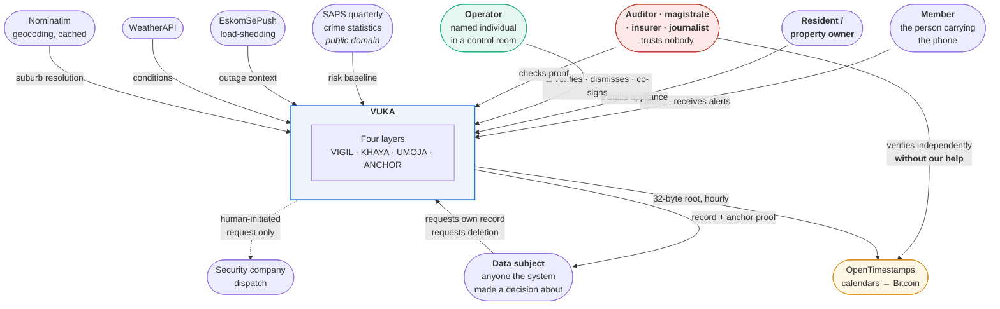

**The single most important edge in this diagram is the dashed one from the auditor to Bitcoin.** It does not pass through VUKA. That is the architecture.

### External interfaces

| # | External system | Direction | Protocol | Failure behaviour | Status |
|---|---|---|---|---|---|
| X1 | OpenTimestamps calendars | out | HTTP, OTS protocol | Root queued locally; retried; liveness gap recorded and published | 🔨 G2 |
| X2 | Security company dispatch | out | Human-initiated request. **Never automatic** | Operator falls back to phone. No degradation of safety, only of convenience | 📋 |
| X3 | SAPS quarterly statistics | in | Bulk file, versioned, checked in with provenance | Last known quarter used, **marked stale** | ✅ |
| X4 | EskomSePush | in | REST, token | Context factor drops out of the prior. Fusion continues without it | ✅ |
| X5 | WeatherAPI | in | REST, key | Same — degrades to no-context | ✅ |
| X6 | Nominatim | in | REST, aggressively cached, rate-limit respected | Cache serves; unknown suburbs render as coordinates, not guesses | ✅ |
| X7 | Push notification transport | out | FCM | WebSocket remains primary; push is redundancy, not the path | ✅ |

> ⚠️ **X1, X4 and X5 previously carried hardcoded credentials in a public repository.** This is recorded as G-6, disclosed in §12.2, and is the entire content of gate G0. Rotation, history purge and a secret-scanning pre-commit hook plus CI gate are the exit criteria.

## 3.2 Level 2 — Containers

*What are the independently deployable units, and what does each one own?*

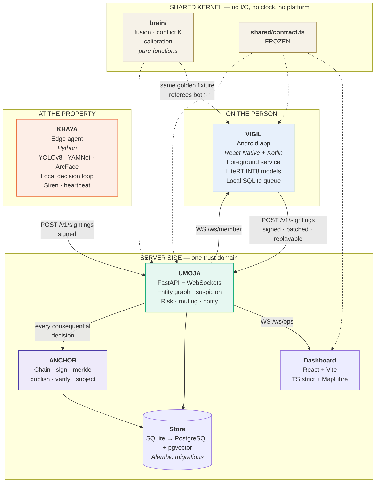

| Container | Language / runtime | Owns | State | Fails how | Status |
|---|---|---|---|---|---|
| **VIGIL** | Kotlin + React Native, LiteRT INT8 | Sensing on the person, on-device fusion, duress credential, offline queue | Local SQLite, encrypted keystore | Fully functional offline; queues and replays | ✅ core built |
| **KHAYA** | Python, ONNX/TFLite | Vision, acoustics, local decision loop, siren, tamper, heartbeat | 3-second audio ring buffer *only*; embeddings | Autonomous locally; siren still works with no uplink | ✅ integration built · ⚠️ hardware not fabricated |
| **UMOJA** | Python 3.11, FastAPI, Uvicorn | Entity graph, suspicion scoring, risk layer, routing, fan-out, the human gate | Authoritative store | Members fall back to local-only; operators lose live view | ✅ built |
| **ANCHOR** | Python 3.11 | Hash chain, signatures, Merkle batching, publication, verification, subject access | Append-only chain + proofs | Chain still verifies internally; anchor gap is recorded, not hidden | 🔨 G2/G3 — **this is the new work** |
| **Dashboard** | React 18 + Vite + TS strict | Operator surface, map, verification UI, co-signature UI | None — projection only | Read-only degraded view from cache | ✅ built |
| **brain/** | Python + TS mirror | Fusion math, conflict K, calibration | **None. By rule.** | n/a — pure | ✅ built |
| **data/** | Python | Ingest, geocode, enrich, forecast, eval | Versioned datasets with provenance | Stale marked stale | ✅ built · ⚠️ forecast fails baseline |
| **ml/eval/** | Python | Calibration, false-alarm budget, bias evaluation | Reports, committed | n/a | 🔨 G4/G5 |

## 3.3 Level 3 — VIGIL components

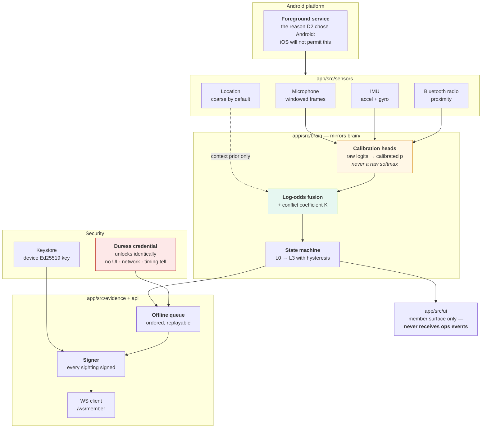

| Component | Responsibility | Key constraint | Status |
|---|---|---|---|
| Foreground service | Survives doze, keeps sensing | The single reason for D2 (Android-first) | ✅ |
| Sensor adapters | Windowed frames from four **physically independent** senses | Principle 2: never fuse two models reading the same signal | ✅ |
| Calibration heads | Map raw model outputs to calibrated probabilities | A raw softmax entering fusion is a **correctness bug** (N7) | 🔨 G4 |
| Fusion | Calibrated log-odds + K | Pure function. Same golden fixture as the server | ✅ |
| State machine | L0–L3 with per-level hysteresis | Separate θ_up / θ_down; anti-flap by construction | ✅ |
| Duress credential | Signal under coercion | **No observable difference** in UI, packet size or timing (F3) | 📋 |
| Offline queue | Order-preserving, replayable | The phone is the source of truth when the network is not there | ✅ |
| Signer | Ed25519 device key from the Android keystore | Every sighting signed. Ingest rejects unsigned (F1) | 🔨 |

## 3.4 Level 3 — KHAYA components

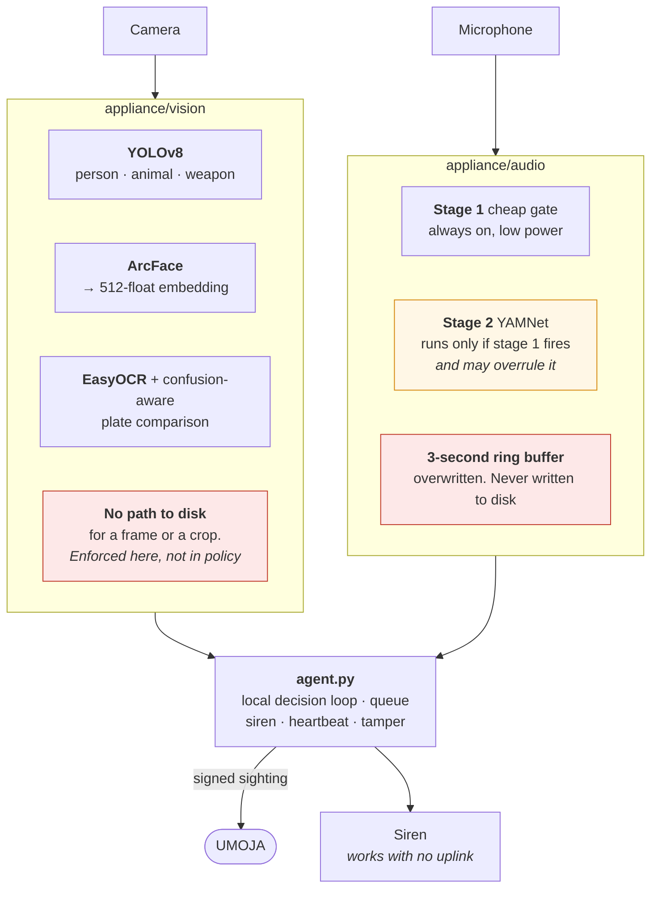

**Two design notes worth stating.**

*The acoustic cascade is not an ensemble.* Stage 2 is not a vote alongside stage 1 — it is an **overrule**. Stage 1 exists to keep the expensive model asleep, not to contribute evidence. Treating it as a second opinion would violate the sensor-independence rule (Principle 2): both stages read the same microphone, and stacking them would multiply correlated errors while pretending they were independent.

*The privacy invariants live in this layer specifically because it is the lowest layer that can hold them.* By the time a sighting reaches UMOJA, the image is already gone. There is nothing for a server-side policy to protect.

## 3.5 Level 3 — UMOJA components

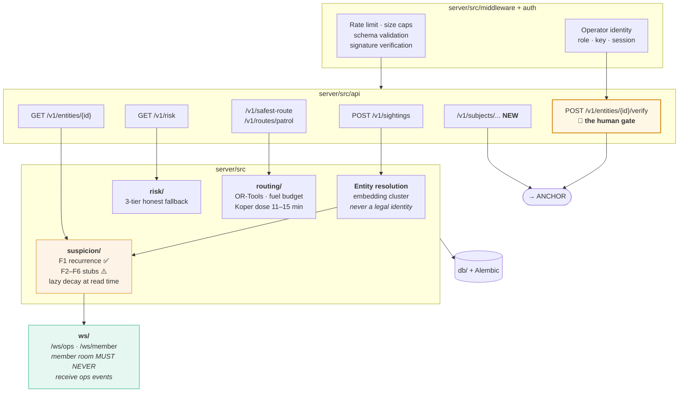

> ⚠️ **Stated honestly: the suspicion engine is 1 of 6 factors implemented.** F1 (recurrence for entities unknown to a street) is built and tested. F2–F6 are documented stubs. This is gap G-4. The *architecture* of the scoring engine is complete and the *content* is not, and those are different claims.

### The two WebSocket rooms are a security boundary, not a convenience

`/ws/member` and `/ws/ops` are separate rooms with separate authorisation, and there is a contract test asserting that an operator event can never appear in a member room. A member who could see the ops feed would learn which entities are under watch — which converts a safety product into a surveillance-evasion tool for exactly the person it is watching.

## 3.6 Level 3 — ANCHOR components

*This is the new work for this cycle, and the reason the project is in the Blockchain-for-Impact track.*

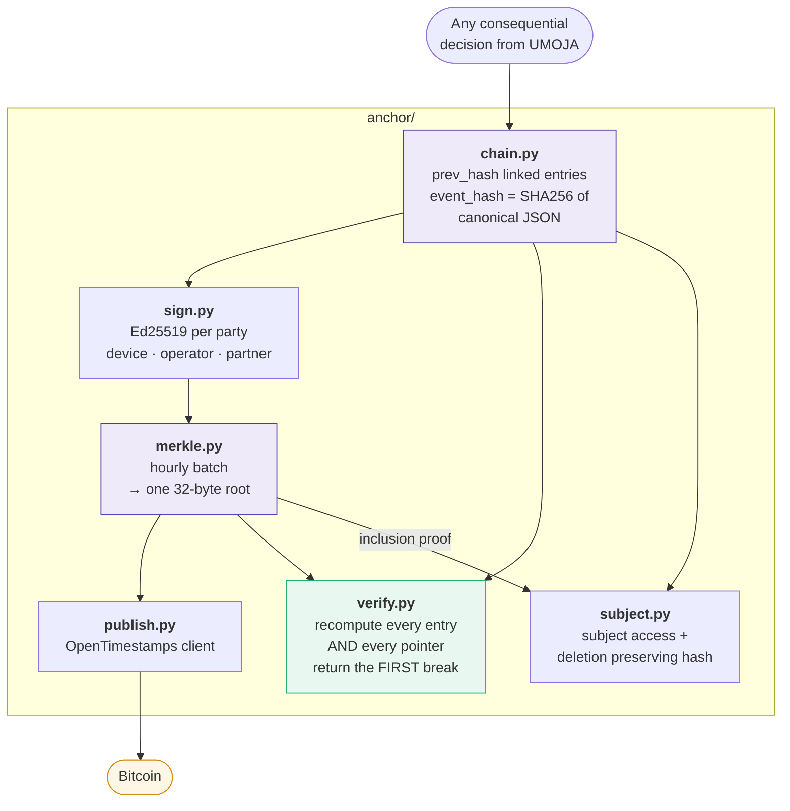

| Module | Responsibility | Requirement | Gate | Status |
|---|---|---|---|---|
| `chain.py` | Prev-hash linked, append-only entries. Ported from `server/src/db` | F10 | — | ✅ ported |
| `sign.py` | Ed25519 keypairs per party; detached signatures over the canonical entry | F11 | G2 | 🔨 |
| `merkle.py` | Hourly batching, one root, inclusion proofs | F12 | G2 | 🔨 |
| `publish.py` | OpenTimestamps submission and upgrade | F16 | G2 | 🔨 |
| `verify.py` | Full-chain integrity **and** anchor verification. Returns the *first* broken link | F10 · F16 | G2 | 🔨 |
| `subject.py` | `GET /v1/subjects/{id}/record` and `DELETE /v1/subjects/{id}/data` | F14 · F15 | G3 | 🔨 |

**Why `verify.py` returns the first break rather than a boolean.** A boolean tells an auditor that something is wrong. The index and hash of the first broken link tells them *what* was tampered with and *when* — which is the difference between a warning and evidence.

## 3.7 The shared kernel, and why it exists

`brain/` (Python) and `app/src/brain/fusion/` (TypeScript) implement the same mathematics for the server and the phone.

The rule: **pure functions. No I/O. No clock. No platform calls.**

That constraint is not stylistic. It exists so that **one golden fixture file is the referee for both implementations**. If the phone and the server disagree about a fusion result, that is a test failure, not a support ticket six months later from a member whose phone escalated when the operator's screen did not.

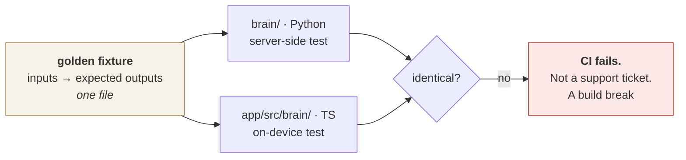

`shared/contract.ts` performs the same job for shapes rather than for maths, and is frozen for the same reason.

## 3.8 Dependency rules

Allowed direction of dependency. A violation is a CI failure, not a review comment.

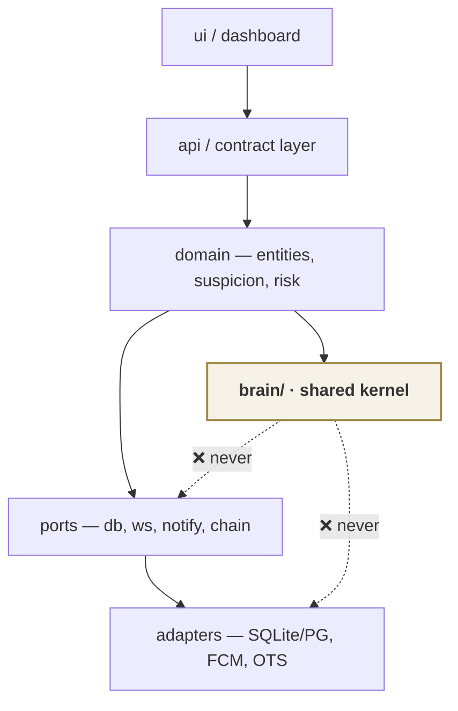

| Rule | Rationale |
|---|---|
| The kernel depends on nothing | It is the only code that can be tested identically on two platforms |
| The domain never imports an adapter | So the database can be swapped SQLite → PostgreSQL without touching scoring |
| The API layer never contains a decision | Every decision is in the domain, where it is testable without HTTP |
| Nothing imports `ui` | Obvious, and asserted anyway |

---

# PART IV · DYNAMIC VIEWS

Six runtime scenarios. Together they exercise every trust boundary in the system.

## 4.1 The decision pipeline, end to end

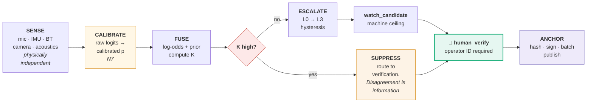

**Read the diagram for what is missing.** There is no arrow from `ESCALATE` to `ANCHOR` that bypasses the human. There is no arrow from the machine to a dispatch. Both absences are the design.

## 4.2 S1 — Coercion. The scenario the product exists for

*22:41, a driveway. The member is forced to unlock their phone.*

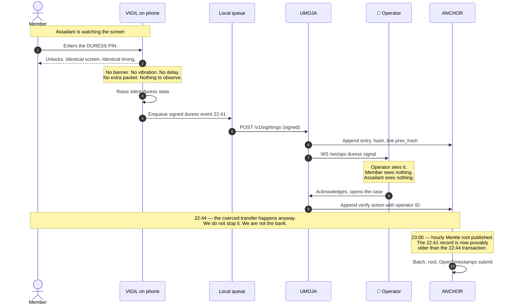

**What this scenario actually buys.** VUKA does not prevent the transfer. Claiming it would be a lie of exactly the kind D14 forbids. What it produces is a **record of duress that provably predates the transaction** — and that is the fact the victim currently cannot establish, because every record the bank holds says they authorised it.

That single ordering — *duress at 22:41 anchored before the transfer at 22:44* — is the difference between "the customer authorised it" and "the customer was under duress and we can prove when we knew."

> The **one-hour anchoring window (trade-off T2)** is visible here and is not hidden: the record is anchored at 23:00, not 22:41. The chain establishes internal ordering immediately; the public anchor establishes it to a stranger at the top of the hour.

## 4.3 S2 — Sighting to human verification

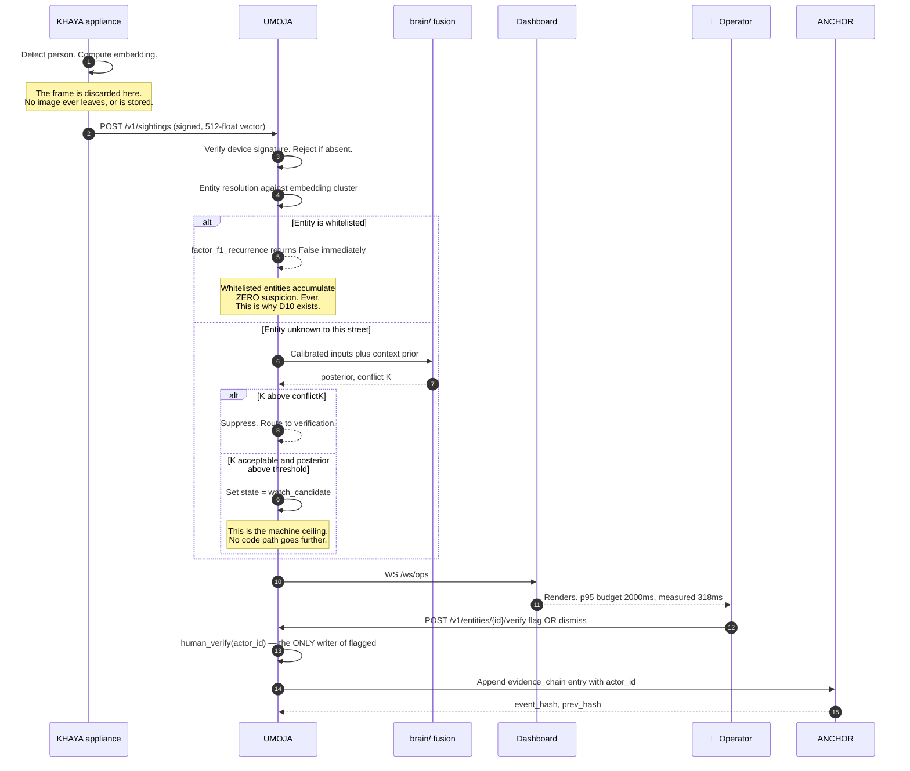

## 4.4 S3 — Two of two. The insider attack, refused

*The highest-value attack on this category of system is not breaking in. It is being let in.*

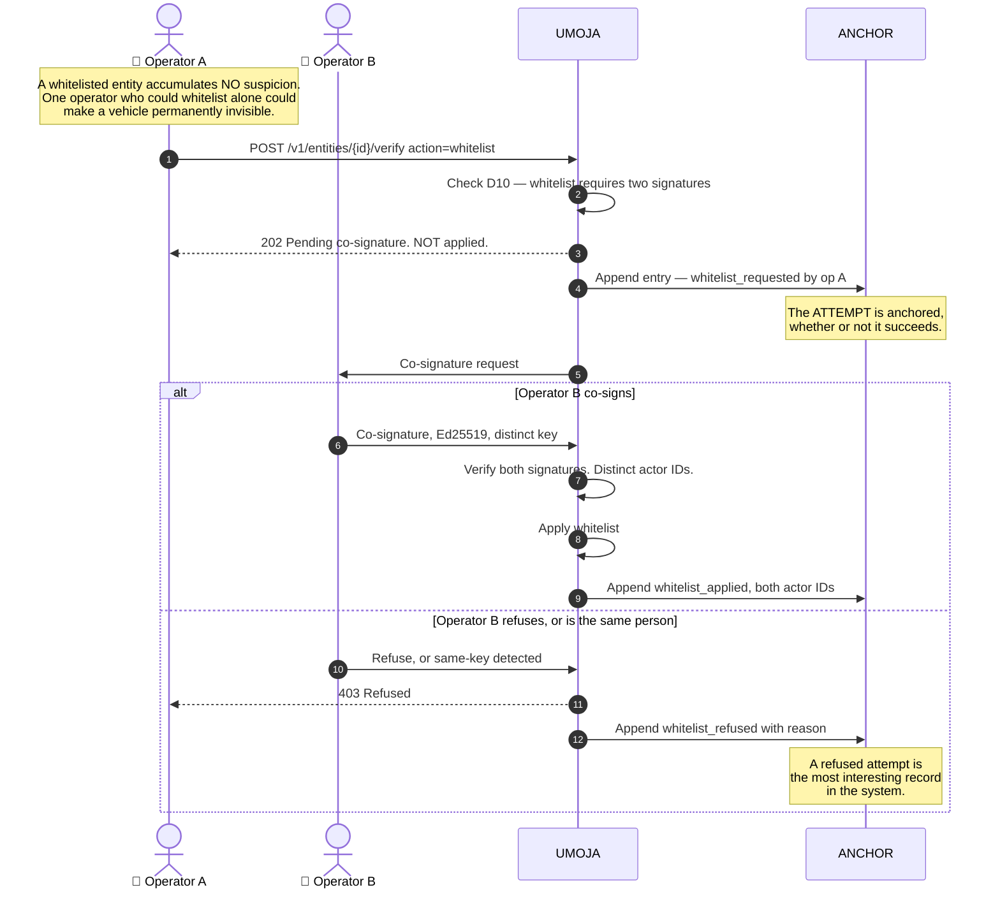

The same two-key rule applies to **camera disarm**, **threshold change** and **record deletion** — the four actions that reduce the system's ability to observe or remember (D10).

## 4.5 S4 — The hourly anchor

```mermaid
sequenceDiagram
    autonumber
    participant U as UMOJA
    participant C as anchor/chain.py
    participant M as anchor/merkle.py
    participant P as anchor/publish.py
    participant OTS as OpenTimestamps calendars
    participant BTC as Bitcoin

    loop Every consequential decision, all hour
        U->>C: Append entry
        C->>C: event_hash = SHA256(canonical JSON)
        C->>C: Link prev_hash
    end
    Note over C: Top of the hour
    C->>M: All leaf hashes for the hour
    M->>M: Build Merkle tree
    M->>M: Root = 32 bytes. Nothing else. Ever.
    M->>P: root
    P->>OTS: Submit root
    OTS-->>P: Incomplete timestamp proof
    OTS->>BTC: Aggregate with other submissions
    Note over OTS,BTC: Cost is fixed per hour,<br/>NOT per user. This is what<br/>makes it about ~R0 a month<br/>for the entire network,<br/>at any network size (OTS primary;<br/>Hedera ~R9–10 fallback).
    BTC-->>OTS: Block confirms
    P->>P: Upgrade proof to complete
    P->>C: Store proof next to the batch
    Note over P: If OTS is unreachable the root<br/>is queued and retried. The gap<br/>is RECORDED and published,<br/>never quietly skipped.
```

### Why the cost is fixed and not per-user

```mermaid
flowchart LR
    subgraph N1["10 members"]
        A1["~500 records/hour"] --> R1["1 root<br/>32 bytes"]
    end
    subgraph N2["100 000 members"]
        A2["~5 000 000 records/hour"] --> R2["1 root<br/>32 bytes"]
    end
    R1 --> COST["<b>Identical on-chain cost</b><br/>~R0 / month<br/>for the whole network (OTS)"]
    R2 --> COST
    style COST fill:#e8f8f0,stroke:#1baf7a,stroke-width:2px
```

This is the single most important economic property of the design, and it comes directly from batching (D9, ASR-8). It is also why we did not need a token, a wallet, or a chain we control.

## 4.6 S5 — A person holds their own file

*This is the acceptance test for the entire project. `CLAUDE.md` §13 point 2.*

```mermaid
sequenceDiagram
    autonumber
    actor S as Data subject
    participant U as UMOJA
    participant SU as anchor/subject.py
    participant M as anchor/merkle.py
    participant X as An independent verifier<br/>who does not trust us
    participant BTC as Bitcoin

    S->>U: GET /v1/subjects/{id}/record
    U->>SU: Assemble decision history
    SU->>SU: Every decision made about this subject
    SU->>M: Inclusion proof for each entry
    M-->>SU: Merkle path plus root plus OTS proof
    SU-->>S: Record plus proofs
    Note over S: The subject now holds<br/>their own file — including<br/>every dismissal, and every<br/>operator ID that touched it.

    S->>X: Hands over the record and the proofs
    X->>X: Recompute each event_hash from the record
    X->>X: Walk the Merkle path to the root
    X->>BTC: Check the root against the chain
    BTC-->>X: Confirmed at block height H, time T
    Note over X,BTC: X reached this conclusion<br/>WITHOUT contacting us,<br/>and could do it in ten years<br/>if we no longer exist.

    opt Subject requests erasure
        S->>U: DELETE /v1/subjects/{id}/data
        U->>SU: Remove payload. Retain hash.
        Note over SU: The personal data is gone.<br/>The PROOF THAT A DECISION<br/>WAS MADE remains — so the<br/>record cannot be quietly<br/>rewritten after erasure.
        SU->>U: Append deletion event to the chain
    end
```

### The deletion design, stated precisely

| Erasure request | What happens | Why |
|---|---|---|
| Personal payload | **Deleted** | POPIA s24 / the data subject's right |
| `event_hash` and `prev_hash` | **Retained** | Otherwise erasure becomes a tamper primitive: anyone wanting to break the chain would simply request deletion |
| The deletion itself | **Appended as a new chain event** | The record shows *that* something was erased and *when* — never *what* |

This is ADR-0023, and it is the honest answer to the apparent conflict between "right to erasure" and "immutable ledger". The conflict is only apparent, because **the ledger never held the personal data in the first place** (E4).

## 4.7 S6 — Degraded operation

*Stage 6 load-shedding. Tower down. Nothing works. This is a Tuesday.*

```mermaid
sequenceDiagram
    autonumber
    participant P as VIGIL
    participant K as KHAYA
    participant U as UMOJA
    participant D as Dashboard

    Note over U: Server unreachable
    P-xU: Connection lost
    P->>P: Continue sensing. Continue fusing.<br/>Continue the state machine.
    P->>P: Queue signed events in order
    Note over P: 100 percent of local protection<br/>retained. The phone was never<br/>a thin client.

    K-xU: Uplink lost
    K->>K: Local decision loop continues
    K->>K: Siren still fires on a local decision
    K->>K: Queue events. Heartbeat records the gap.

    D->>D: Serve last-known state, MARKED STALE
    Note over D: Never blank. Never invented.<br/>A stale figure that says it is stale<br/>is useful. A confident wrong figure<br/>is dangerous.

    Note over P,U: Connectivity returns
    P->>U: Replay queue, in order, all signed
    K->>U: Replay queue
    U->>U: Idempotent ingest. Ordering preserved.
    U->>D: Live again. Staleness marker cleared.
```

## 4.8 State machines

### Escalation state — L0 to L3, with hysteresis

```mermaid
stateDiagram-v2
    direction LR
    [*] --> L0
    L0 --> L1: posterior >= theta_up[1]<br/>AND K <= conflictK
    L1 --> L2: posterior >= theta_up[2]<br/>AND K <= conflictK
    L2 --> L3: posterior >= theta_up[3]<br/>AND K <= conflictK
    L3 --> L2: posterior < theta_down[3]
    L2 --> L1: posterior < theta_down[2]
    L1 --> L0: posterior < theta_down[1]
    note right of L1
        theta_down is strictly below theta_up
        at every level. That gap IS the
        anti-flap design. Without it the
        system oscillates at the boundary
        and the member stops believing it.
    end note
```

### Entity lifecycle — where the machine stops

```mermaid
stateDiagram-v2
    direction LR
    [*] --> observed
    observed --> watch_candidate: machine — <b>this is the ceiling</b>
    watch_candidate --> flagged: 👤 human_verify, operator ID
    watch_candidate --> dismissed: 👤 human_verify
    observed --> dismissed: 👤 human_verify
    watch_candidate --> whitelisted: 👤👤 human_verify + <b>co-signature</b>
    observed --> whitelisted: 👤👤 two signatures
    flagged --> dismissed: 👤 human_verify
    note right of watch_candidate
        No code path in this system
        can produce "flagged".
        Only human_verify() can,
        and it requires an operator ID.
        A contract test asserts this,
        and CI greps for the state
        name outside that one function.
    end note
```

| State | Who may set it | Enforcement |
|---|---|---|
| `observed` | machine | automatic |
| `watch_candidate` | **machine — this is its ceiling** | automatic |
| `flagged` | **human only, operator ID required** | `human_verify()` only. No other path exists |
| `dismissed` | human only | `human_verify()` |
| `whitelisted` | **human only, TWO signatures** | `human_verify()` + co-signature |

## 4.9 The two-second budget, decomposed

`scripts/latency.py` is the referee, and it matches by request ID so that a concurrent probe cannot corrupt the measurement.

```mermaid
flowchart LR
    A["Detection<br/>on device"] -->|"~40 ms<br/>INT8 inference"| B["Calibrate<br/>+ fuse"]
    B -->|"~5 ms<br/>pure function"| C["Sign +<br/>enqueue"]
    C -->|"network"| D["Ingest +<br/>verify signature"]
    D -->|"~30 ms"| E["Resolve +<br/>score"]
    E -->|"~20 ms"| F["WS fan-out"]
    F -->|"render"| G["Operator sees it"]
    style G fill:#e8f8f0,stroke:#1baf7a
```

| Budget | Target | Measured | Referee |
|---|---|---|---|
| Detection → alert render, **p95** | ≤ 2 000 ms | **318 ms** (n = 10) | `scripts/latency.py` |
| Detection → alert render, **p50** | — | **273 ms** | same |
| Per-inference, 2 GB Android device | ≤ 50 ms | meets | bench |
| Vision throughput, person detection | ≥ 8 FPS | meets | appliance bench |

We are **6.3× inside** the budget at p95. That headroom is deliberate: it is the room the human gate consumes. An operator looking at a screen is slower than any of these numbers, and the architecture is built so that the machine's speed is never the reason a person is accused faster.

---

# PART V · THE DECISION ENGINE

## 5.1 Design intent

The decision engine has one job that is not "be accurate": **it must know when it does not know, and it must say so in a way that suppresses action rather than encouraging it.**

Everything below follows from that.

## 5.2 The sensor independence rule

> **Fuse only physically independent senses.** Microphone, IMU, Bluetooth radio and camera observe the world through different physics. Two models reading the same microphone do not.

Stacking models that read the same signal and multiplying their error rates as if independent is **the single most common overclaim in this product category**, and it is on our own honesty ledger. It is why the KHAYA acoustic cascade is an *overrule*, not an ensemble (§3.4): stage 1 exists to save power, not to vote.

```mermaid
flowchart TB
    subgraph OK["✅ Legitimate fusion — independent physics"]
        M1["Microphone"] --> F1["fuse"]
        M2["IMU"] --> F1
        M3["Bluetooth radio"] --> F1
        M4["Camera"] --> F1
    end
    subgraph BAD["❌ Refused — correlated errors dressed as independence"]
        S1["Model A on the mic"] --> F2["'fuse'"]
        S2["Model B on the same mic"] --> F2
        S3["Model C on the same mic"] --> F2
    end
    style OK fill:#e8f8f0,stroke:#1baf7a
    style BAD fill:#fde8e8,stroke:#c0392b
```

## 5.3 The mathematics

**Prior — the South African context term:**

```
prior = base + β_stage · stage + β_cell · cellRisk + β_hour · hourRisk
```

where `stage` is the load-shedding stage, `cellRisk` the risk of the spatial cell, and `hourRisk` the hour-of-day term.

**Posterior — calibrated log-odds fusion:**

```
posterior = σ( prior + Σᵢ wᵢ · logit(pᵢ) )
```

Every `pᵢ` is a **calibrated** probability from a calibration head, never a raw softmax. `wᵢ` is the per-modality weight.

**Conflict coefficient:**

```
K = 1 − exp( − mean over opposing pairs of min(|llrᵢ|, |llrⱼ|) )
```

K measures how strongly the evidence *disagrees with itself*. Two sensors each confidently asserting opposite conclusions produce a high K.

**The escalation condition — note that it is a conjunction:**

```
escalate  ⟺  posterior ≥ θ_up[level]   AND   K ≤ conflictK
```

## 5.4 Why disagreement suppresses

> **Disagreement is information. Never average it away.**

The naive approach to two contradictory sensors is to average them, which produces a middling confidence and a system that acts on a case it does not understand. VUKA does the opposite: high K **blocks** escalation and routes to human verification.

```mermaid
flowchart LR
    E1["Sensor A:<br/>strong YES"] --> K{"K"}
    E2["Sensor B:<br/>strong NO"] --> K
    K -->|"K high"| SUP["<b>SUPPRESS</b><br/>Do not escalate.<br/>Route to a human.<br/><i>The system does not<br/>understand this case.</i>"]
    A1["Sensor A:<br/>weak yes"] --> K2{"K"}
    A2["Sensor B:<br/>weak yes"] --> K2
    K2 -->|"K low"| ESC["Escalate if the<br/>posterior clears θ_up"]
    style SUP fill:#fdf3e6,stroke:#d68910,stroke-width:2px
    style ESC fill:#e8f8f0,stroke:#1baf7a
```

This is a deliberate bias toward inaction, and it is correct for this domain: **the cost of a missed detection is borne by the system; the cost of a false accusation is borne by a person.** Those are not symmetric and the engine is not built as though they were.

## 5.5 Why Dempster–Shafer was rejected — ADR-0005

Dempster–Shafer is the obvious academic choice for evidence combination under uncertainty, and we rejected it.

The reason is **Zadeh's paradox**: under high conflict, Dempster's rule of combination produces results that are not merely imprecise but *actively misleading* — it can assign near-certainty to a hypothesis that both sources considered nearly impossible, purely because they disagreed about everything else.

> **Our worst cases are precisely the high-conflict ones.** A method that misbehaves exactly where we most need it to be careful is not a sophisticated choice, it is a liability. Calibrated log-odds with an explicit, separately-reported conflict coefficient gives us the same expressiveness with a failure mode we can see, test, and act on.

The conflict is not hidden inside the combination rule. It is a **named output** that gates the decision. That is the whole difference.

## 5.6 Calibration — what the word means here, and its honest status

"Calibrated" has a specific, measurable meaning: **of all the events assigned probability 0.7, about 70 % should actually occur.** It is measured with a reliability diagram and summarised as Expected Calibration Error (ECE).

```mermaid
flowchart LR
    RAW["Raw model output<br/><i>a softmax. Means nothing<br/>about frequency.</i>"] --> HEAD["<b>Calibration head</b><br/>fitted on held-out data"]
    HEAD --> P["Calibrated p<br/><i>0.7 means 70 percent</i>"]
    P --> FUSE["Fusion"]
    RAW -.->|"❌ correctness bug<br/>not a style issue"| FUSE
    style RAW fill:#fde8e8,stroke:#c0392b
    style HEAD fill:#fff7e6,stroke:#d68910
    style P fill:#e8f8f0,stroke:#1baf7a
```

### ⚠️ Where we actually stand — G-1, published

| Item | Status |
|---|---|
| `ml/eval/calibration.py` — reliability diagrams, ECE | ✅ **BUILT**. Its own header states it proves *the math* works, not that any model is calibrated |
| Fusion weights `wᵢ` and priors `β` | ⚠️ **Hand-set from a cost matrix. NOT fitted on real data.** `fusion_params.json` self-labels *"PROVISIONAL — NOT fit on real data"* |
| `F1_LOG_ODDS = 2.2` | ⚠️ marked in the source as `# calibrated placeholder` |
| Face-match thresholds — candidate ≥ 0.55, verify-suggest ≥ 0.65 cosine | ⚠️ **Targets. Uncalibrated.** Labelled as such everywhere they appear |
| Fitting the weights on real data, publishing the reliability diagram and ECE | 🔨 **G4 · 20 September** — including if the diagram looks bad |

**The self-labelling is the point.** A parameter file that declares its own provisional status cannot silently become a claim.

### The context prior is weaker than the story implies — and we say so

We ran our own fusion to find out how much the uniquely South African context term actually moves the decision:

| Contribution | Log-odds |
|---|---|
| Load-shedding + area + hour prior | **at most 0.90** |
| Three independent modalities | **~2.97** |
| Context share of total signal | **≈ 23 %** |

Worked at the decision boundary: the same sensor evidence in a calm context gives **0.860**; in Stage-4 load-shedding, a high-risk cell, at night, it gives **0.936**. **Both land at L3.** The context term is real and it is our best story, but at the boundary it currently barely changes the outcome.

Either the β's rise with a published justification, or the magnitude is stated honestly. We chose to state it — and we state it before a judge runs the numbers themselves.

## 5.7 Hysteresis

Each level has a **separate** `θ_up` and `θ_down`, with `θ_down` strictly lower. The gap between them is the anti-flap design.

Without it, a posterior hovering at a threshold produces an alert that fires, clears, fires, clears. The technical description is oscillation. The human description is that the member stops believing the app, and after that the accuracy of the detector is irrelevant — which returns us to §1.2.

## 5.8 The suspicion score and lazy decay

Suspicion is calibrated log-odds over sighting-graph factors, and it **decays**:

```
score_now = base × 0.5^(days / 7)
```

A one-week half-life, **computed at read time**, not by a scheduler.

| Consequence | Why it matters |
|---|---|
| No background job | One less thing to fail at 02:00, and one less thing to be misconfigured |
| No stale rows | The score is correct the instant it is read, by construction |
| No clock skew between writer and reader | The read is the only place time is consulted |
| Testable as a pure function | Given a base and an elapsed time, the answer is deterministic |

This is a small decision that pays for itself repeatedly. It is included here because it is a good example of the general principle: **prefer designs where the failure mode does not exist to designs where the failure mode is handled.**

### Whitelist before watchlist

```python
def factor_f1_recurrence(entity: Entity, is_whitelisted: bool) -> bool:
    if is_whitelisted:
        return False          # ← returns immediately. No suspicion can accumulate. Ever.
```

Residents, workers and regular deliveries are learned **first**. Recurrence only counts for an entity unknown to the street. Without this, the system's most reliable output would be "this person lives here", and every resident would eventually be flagged by their own front gate.

> **This four-line function is also the highest-value insider attack surface in the entire product.** An operator who can whitelist alone can make any vehicle permanently invisible to the network — silently, permanently, and with no accumulated evidence to later notice. That is precisely why D10 exists and why §4.4 requires two signatures. The vulnerability came first; the governance control was derived from it.

### ⚠️ Honest status of the suspicion engine

**1 of 6 factors implemented.** F1 (recurrence) is built and tested. F2–F6 are documented stubs. Gap G-4. The scoring architecture is complete; the factor library is not.

## 5.9 The human gate — the invariant

This is the most important line of code in the system, and it is an absence:

> **There is no code path in VUKA that sets `flagged`.** Only `human_verify()` does, and it requires an operator ID.

| Enforcement layer | Mechanism |
|---|---|
| Type / API | The state transition is not exposed on any machine-callable path |
| Contract test | Asserts that no other code path can produce the state |
| CI grep gate | The state name may not appear as an assignment outside `human_verify()` |
| Evidence chain | Every invocation writes an entry with the operator's ID — so the human is named, not merely present |

The driver was NIST FRVT: demographic false-positive differentials up to roughly **two orders of magnitude**. Our answer is not a better matcher. It is that the matcher **is not allowed to conclude anything about a person** (§2.4).

> ⚠️ **G-9, published:** we have not yet run a bias evaluation on our own face pipeline. Our stated answer to FRVT differentials is therefore **architecturally sound and empirically untested**. `ml/eval/bias_eval.py` is scheduled for G5. Until it runs, this section describes a design, not a measurement.

---

# PART VI · DATA ARCHITECTURE

## 6.1 Data classification — the tiers that govern everything

Every piece of data in VUKA belongs to exactly one tier, and the tier determines what may be done with it. The boundaries are enforced in code.

```mermaid
flowchart TB
    T0["<b>T0 · NEVER PERSISTED</b><br/>Raw video frames · raw audio<br/>Face crops<br/><i>3-second ring buffer, overwritten</i><br/><b>No code path to disk exists</b>"]
    T1["<b>T1 · PERSONAL — highest protection</b><br/>Biometric embeddings, 512-float<br/>Member location · device identity<br/><i>Encrypted. TTL. Subject-accessible. Erasable.</i>"]
    T2["<b>T2 · OPERATIONAL</b><br/>Sightings · entity clusters · scores<br/>Operator actions · evidence chain<br/><i>Append-only. Hashed. Signed.</i>"]
    T3["<b>T3 · PUBLIC — leaves the building</b><br/><b>One 32-byte Merkle root per hour</b><br/><i>and nothing else, ever</i>"]
    T0 -.->|"embedding only —<br/>never the image"| T1
    T1 -->|"resolved, scored"| T2
    T2 -->|"hash of a hash"| T3
    T3 --> BTC(["Bitcoin"])
    style T0 fill:#fde8e8,stroke:#c0392b,stroke-width:2px
    style T1 fill:#fdf3e6,stroke:#d68910
    style T2 fill:#e6f7f1,stroke:#1baf7a
    style T3 fill:#eeeafa,stroke:#4a3aa7
```

| Tier | May be logged? | May be exported? | May go on chain? | Retention |
|---|---|---|---|---|
| **T0** | ❌ Never | ❌ Never | ❌ Never | Milliseconds. Ring buffer |
| **T1** | ❌ Not in plaintext | Only to the subject | ❌ Never | TTL, then erased |
| **T2** | ✅ | To the subject, and to a partner under contract | ❌ Only its hash | Append-only, retention policy applies to payload |
| **T3** | ✅ | ✅ It is already public | ✅ This *is* the on-chain object | Permanent, by design |

> **The tier boundary between T2 and T3 is the single most important line in this document.** Only a hash of a hash crosses it. No name, no face, no vector, no coordinate, no time-of-day about a person — ever. This is E4, and it is what makes "we put it on a blockchain" a privacy-preserving statement rather than the opposite.

## 6.2 Logical data model

The physical schema is 11 tables under Alembic migration from the first commit (4 versions to date). This is the **logical** model — the shape the domain actually has.

```mermaid
erDiagram
    MEMBER ||--o{ DEVICE : registers
    APPLIANCE ||--o{ CAMERA : hosts
    DEVICE ||--o{ SIGHTING : emits
    CAMERA ||--o{ SIGHTING : emits
    ENTITY ||--o{ SIGHTING : "resolved from"
    RISK_CELL ||--o{ SIGHTING : contextualises
    ENTITY ||--o| WHITELIST : "may be"
    ENTITY ||--o{ SUSPICION_FACTOR : accumulates

    ENTITY {
        string entity_id PK "NOT a legal identity"
        vector embedding_centroid "512 float. No image"
        string state "5 states, see below"
        float base_score "decayed at READ time"
        timestamp first_seen
        timestamp last_seen
    }
    SIGHTING {
        string sighting_id PK
        string entity_id FK
        string source_id FK "device or camera"
        string modality "face plate vehicle acoustic imu"
        float confidence "CALIBRATED"
        string hex_cell
        timestamp ts
        blob device_signature "REQUIRED. Else rejected"
    }
    WHITELIST {
        string entity_id PK
        string added_by "operator A"
        string cosigned_by "operator B. D10"
        timestamp added_at
    }
```

The second half is the part no competitor has: **not what was seen, but what was decided about it, by whom, and when it became unchangeable.**

```mermaid
erDiagram
    ENTITY ||--o{ VERIFICATION : "subject of"
    OPERATOR ||--o{ VERIFICATION : performs
    VERIFICATION ||--|| EVIDENCE_ENTRY : writes
    EVIDENCE_ENTRY ||--o| EVIDENCE_ENTRY : "prev_hash links to"
    EVIDENCE_ENTRY }o--|| ANCHOR_BATCH : "batched into"
    ANCHOR_BATCH ||--o| OTS_PROOF : "proven by"

    EVIDENCE_ENTRY {
        string event_hash PK "SHA256 canonical JSON"
        string prev_hash FK "the chain"
        string action
        string actor_id "an OPERATOR, never a service"
        string target_type
        string target_id
        json details
        timestamp ts
    }
    ANCHOR_BATCH {
        string root PK "32 bytes. All that leaves"
        int record_count
        timestamp hour_start
        string ots_status "pending or complete"
    }
    OPERATOR {
        string actor_id PK
        string role
        blob ed25519_public_key
    }
```

## 6.3 Entity dictionary — the terms that carry legal weight

| Term | Definition | What it is **not** |
|---|---|---|
| **Sighting** | One detection event: entity, camera, hex cell, timestamp, modality, calibrated confidence | Not a proof of presence |
| **Entity** | A resolved embedding cluster | ❌ **Never a legal identity.** It has no name, and the system has no mechanism to give it one |
| **Suspicion score** | Calibrated log-odds over sighting-graph factors, decayed at read time | Not a probability of guilt. Capped below action without human verification |
| **Conflict coefficient K** | Pairwise opposing-evidence measure | Not a confidence interval |
| **Whitelist** | Residents and regulars known to a street. A whitelisted entity accumulates **no** suspicion | Not a permission to enter |
| **Watch candidate** | Machine-proposed. **The ceiling of machine authority** | Not an accusation |
| **Flagged** | Human-verified by a named operator. Only this pre-arms anything | Not a criminal record, not a charge, not evidence of a crime |
| **Digital cordon** | Downstream cameras pre-armed along a predicted trajectory. **Human-gated, never contract-triggered** | Not pursuit, not interception |
| **Precedence** | Proof a record existed *before anyone had a reason to falsify it* | ❌ Not immutability. ❌ Not admissibility. ❌ Not truth |
| **Duress credential** | A PIN that unlocks *identically* to the real one while signalling | Not a panic button — a panic button requires a free hand and privacy |
| **Koper dose** | 11–15 minute patrol dwell at a hotspot for maximum residual deterrence | Not a stakeout |

## 6.4 Data flow across trust boundaries

This diagram doubles as the threat-model DFD. Each numbered boundary is analysed in §9.1.

```mermaid
flowchart TB
    subgraph TB1["TRUST BOUNDARY 1 — the person's device"]
        SENSORS["Sensors"] --> ONDEV["On-device inference<br/>+ fusion"]
        ONDEV --> QUEUE["Signed local queue"]
    end
    subgraph TB2["TRUST BOUNDARY 2 — the premises"]
        FRAME["Frame buffer<br/><b>T0</b>"] --> EMB["Embedding<br/><b>T1</b>"]
        FRAME -.->|"❌ no path"| DISK[("disk")]
    end
    subgraph TB3["TRUST BOUNDARY 3 — the server"]
        INGEST["Ingest<br/>verify signature"] --> RESOLVE["Resolve"] --> SCORE["Score"]
        SCORE --> GATE["👤 human gate"]
        GATE --> CHAIN["Evidence chain<br/><b>T2</b>"]
    end
    subgraph TB4["TRUST BOUNDARY 4 — the public"]
        ROOT["32-byte root<br/><b>T3</b>"] --> PUBLIC(["Bitcoin"])
    end
    QUEUE ==>|"signed · replayable"| INGEST
    EMB ==>|"signed · vector only"| INGEST
    CHAIN ==>|"hash of a hash"| ROOT
    style TB1 fill:#e7f0fb,stroke:#2a78d6,stroke-dasharray: 5 5
    style TB2 fill:#fdeee7,stroke:#eb6834,stroke-dasharray: 5 5
    style TB3 fill:#e6f7f1,stroke:#1baf7a,stroke-dasharray: 5 5
    style TB4 fill:#eeeafa,stroke:#4a3aa7,stroke-dasharray: 5 5
    style DISK fill:#fde8e8,stroke:#c0392b
```

## 6.5 Retention schedule

📋 **SPECIFIED — implementation is G3.** This is part of gap G-3 and is disclosed as undischarged.

| Data class | Tier | Retention | Trigger for deletion | Requirement |
|---|---|---|---|---|
| Raw frames, raw audio | T0 | **Not retained** — 3-second ring buffer | Continuous overwrite | E3 |
| Face crops | T0 | **Never written** | n/a — no code path exists | E2 |
| Biometric embeddings, no linked incident | T1 | 30 days | TTL sweep | F15 |
| Biometric embeddings, linked to an open case | T1 | Case lifetime + 90 days | Case closure | F15 |
| Member location traces | T1 | 7 days rolling | TTL sweep | F15 |
| Sightings | T2 | 12 months | TTL sweep | F15 |
| Evidence chain **payload** | T2 | 12 months, or on subject request | Subject request or TTL | F15 |
| Evidence chain **hashes** | T2 | **Permanent** | Never — deleting them would make erasure a tamper primitive | F15 |
| Merkle roots and OTS proofs | T3 | **Permanent** | Never — already public | D9 |
| Operator action log | T2 | 7 years | Retained for accountability of the accuser, not the accused | — |

## 6.6 What is deliberately never stored

| Not stored | Consequence we accept | Consequence we gain |
|---|---|---|
| Face images | No forensic photo, no retraining on production data | **We cannot be compelled to produce what we do not hold** |
| Raw audio | No "listen to the recording" review | The microphone is not a surveillance device, structurally |
| Precise location by default | Coarser context prior | The location trace does not exist to be subpoenaed or leaked |
| Names against entities | The system genuinely cannot tell you *who* someone is | An entity ID cannot be socially weaponised |
| Anything at all on chain except a root | No on-chain analytics | Chain analysis of our anchor reveals **nothing** about any person |

## 6.7 Deletion semantics — ADR-0023

```mermaid
flowchart LR
    REQ["Subject requests<br/>erasure"] --> SPLIT{" "}
    SPLIT -->|"personal payload"| DEL["<b>DELETED</b><br/>irrecoverably"]
    SPLIT -->|"event_hash<br/>prev_hash"| KEEP["<b>RETAINED</b><br/>the chain still verifies"]
    SPLIT -->|"the deletion itself"| NEW["<b>APPENDED</b><br/>as a new chain event"]
    DEL --> RESULT["Personal data gone.<br/>Proof that a decision was made,<br/>and that it was later erased,<br/>remains checkable."]
    KEEP --> RESULT
    NEW --> RESULT
    style DEL fill:#fde8e8,stroke:#c0392b
    style KEEP fill:#eeeafa,stroke:#4a3aa7
    style RESULT fill:#e8f8f0,stroke:#1baf7a
```

The apparent conflict between the right to erasure and an append-only ledger dissolves once you notice that **the ledger never held the personal data**. It held a hash. Erasure removes the payload; the hash remains as evidence that the record is not being quietly rewritten *after* the erasure.

If hashes were deletable, an adversary wanting to break the chain would simply file a deletion request. That is not a hypothetical — it is the obvious attack, and the design forecloses it.

## 6.8 Schema evolution

Alembic from the first commit — 4 migration versions, 11 tables. Not a single init script.

> Schema state is never ad-hoc, and **the upgrade path to PostgreSQL was designed rather than discovered.** The SQLite → PostgreSQL + pgvector move is a migration, not a rewrite, precisely because the schema was under migration control before it needed to be.

---

# PART VII · TRUST ARCHITECTURE

*The blockchain part, done properly — which mostly means done narrowly.*

## 7.1 The problem restated

Immutability is what people say blockchain gives you, and it is the weaker half.

Our `evidence_chain` is **already effectively immutable internally**: `evidence_integrity.py` walks every link and recomputes every hash. What internal immutability cannot give us is **precedence** — proof that a record existed at a particular moment, verifiable by someone who does not trust us.

```mermaid
flowchart TB
    Q["<b>Was the alarm raised at 22:41,<br/>or did you write that in afterwards?</b>"]
    Q --> DB["Our database says 22:41"]
    DB --> WHO{"Who owns<br/>that database?"}
    WHO -->|"We do"| NO["<b>We are a party to the dispute.</b><br/>Our record is our claim,<br/>not evidence.<br/><i>No amount of database<br/>hardening fixes this.</i>"]
    Q --> CHAIN["A 32-byte root published<br/>to Bitcoin at 23:00"]
    CHAIN --> WHO2{"Who owns<br/>Bitcoin?"}
    WHO2 -->|"Nobody in this dispute"| YES["<b>Precedence established.</b><br/>Checkable by the other party,<br/>without our cooperation,<br/>in ten years."]
    style NO fill:#fde8e8,stroke:#c0392b
    style YES fill:#e8f8f0,stroke:#1baf7a,stroke-width:2px
```

## 7.2 The four tiers of the trust boundary

```mermaid
flowchart TB
    T0["<b>TIER 0 — never leaves the device or premises</b><br/>Frames · raw audio · face crops<br/><i>No code path to disk</i>"]
    T1["<b>TIER 1 — hash-chained, private</b><br/>evidence_chain: action · actor · target · details · ts · prev_hash<br/><i>Internally tamper-evident. Recomputable end to end.</i>"]
    T2["<b>TIER 2 — signed attestations</b><br/>Ed25519 per party: the device, the operator, the partner<br/><i>Not just what happened — who asserted it</i>"]
    T3["<b>TIER 3 — public anchor</b><br/>One 32-byte Merkle root per hour<br/><i>The only thing that ever leaves</i>"]
    T0 --> T1 --> T2 --> T3
    style T0 fill:#fde8e8,stroke:#c0392b
    style T1 fill:#fdf3e6,stroke:#d68910
    style T2 fill:#e6f7f1,stroke:#1baf7a
    style T3 fill:#eeeafa,stroke:#4a3aa7
```

## 7.3 Hash chain construction

```
event_hash = SHA256( json.dumps(entry, sort_keys=True) )
```

The canonical entry:

```json
{ "action": "verify_dismiss", "actor_id": "op_A41", "target_type": "entity",
  "target_id": "ent_7f3a…", "details": {"reason": "recognised delivery route"},
  "ts": "2026-08-18T16:22:04+02:00", "prev_hash": "4c1f…" }
```

| Design point | Why |
|---|---|
| `sort_keys=True` | Canonicalisation. Two implementations must produce byte-identical input, or the hash is meaningless as a cross-party check |
| `prev_hash` inside the hashed body | Reordering is detectable, not just modification |
| `actor_id` is always a **human** operator, never a service account | An action nobody is accountable for is not a decision, it is an accident |
| `details` is free-form JSON | So the *reason* travels with the decision. The dismissal reason above is the record that protects the delivery driver |

**The verifier recomputes every entry *and* every pointer, and returns the *first* broken link** — the index and hash, not a boolean. A boolean says something is wrong; the first break says what and when.

## 7.4 Signatures and key custody

| Key | Held by | Stored in | Signs | Rotation |
|---|---|---|---|---|
| **Device key** | The member's phone | Android hardware keystore, non-exportable | Every sighting | On re-enrolment |
| **Appliance key** | KHAYA unit | Local secure element | Every sighting | On service |
| **Operator key** | The individual operator, not the shift or the role | Server-side custody with per-operator separation | Every `human_verify`, every co-signature | On role change or departure |
| **Partner key** | Security company / insurer | Theirs. We hold only the public half | Their attestations | Their policy |

**Compromise handling.** A revoked key does not invalidate history: entries signed before the revocation timestamp remain valid, entries after it do not. That property is why revocation is itself a chain event — the revocation is anchored, so the boundary between "valid" and "invalid" cannot be moved after the fact.

> ⚠️ Key management is currently **📋 SPECIFIED**, not built. Operator key custody in particular has an obvious weakness worth naming: if we hold operator private keys server-side, a sufficiently privileged insider at our end could forge an operator signature. Hardware-backed operator keys are the correct answer and are on the post-hackathon roadmap (§11.2). Until then, the two-of-two rule (D10) means such an attack requires forging **two distinct** operators, and the attempt is anchored.

## 7.5 Merkle batching

```mermaid
flowchart TB
    L1["h1"] --> N1["H(h1‖h2)"]
    L2["h2"] --> N1
    L3["h3"] --> N2["H(h3‖h4)"]
    L4["h4"] --> N2
    N1 --> ROOT["<b>ROOT — 32 bytes</b><br/>this hour"]
    N2 --> ROOT
    ROOT --> OTS["OpenTimestamps"]
    OTS --> BTC(["Bitcoin"])
    PROOF["<b>Inclusion proof for h3</b><br/>= h4, then H(h1‖h2)<br/><i>two hashes prove membership<br/>of a batch of any size</i>"] -.-> N2
    style ROOT fill:#eeeafa,stroke:#4a3aa7,stroke-width:2px
    style PROOF fill:#e8f8f0,stroke:#1baf7a
```

An inclusion proof is `log₂(n)` hashes. For a batch of a million records that is twenty hashes — a few hundred bytes handed to a data subject, enough for a stranger to verify membership without seeing any other record in the batch.

**That last clause is a privacy property, not just an efficiency one.** The proof reveals nothing about the other records in the hour.

## 7.6 Public anchoring — why OpenTimestamps, why Bitcoin

| Requirement | OpenTimestamps → Bitcoin | Hedera Consensus Service | A chain we run |
|---|---|---|---|
| No wallet, no token, no account | ✅ | ⚠️ account required | ✅ |
| Cost at network scale | **~R0 / month, total** (OTS primary) | Low but per-message | Infrastructure cost |
| **Longevity — a claim may reach a court in ten years** | ✅ the strongest bet available | ⚠️ younger, corporate governance | ❌ dies with the company |
| Latency to finality | ~1 hour | seconds | instant |
| **Verifier does not need us** | ✅ | ✅ | ❌ **fatal** |
| Chosen | ✅ **D8 primary** | ✅ D8 low-latency alternative | ❌ **D11 rejected** |

> **Why not a permissioned chain, stated once.** A consortium chain run by the insurer, the security company and us does not solve the trust problem *for the member*, because **the parties to the dispute would be the validators.** It is a better database with a worse name. That is D11 and ADR-0021.

Latency was the trade we accepted (T2). We chose the property that survives us.

## 7.7 The proof artefact

What a data subject actually receives, and what a stranger needs to check it:

```mermaid
flowchart LR
    subgraph BUNDLE["What the subject is handed"]
        direction TB
        REC["The decision records<br/>in canonical JSON"]
        PATH["Merkle path<br/>per record"]
        ROOT2["The batch root"]
        OTSP["The OTS proof<br/>root → Bitcoin"]
        REC ~~~ PATH ~~~ ROOT2 ~~~ OTSP
    end
    subgraph CHECK["What a stranger does with it"]
        direction TB
        C1["1 · Recompute <i>event_hash</i><br/>from the record"]
        C2["2 · Walk the Merkle path<br/>to the root"]
        C3["3 · Check the OTS proof<br/>against the Bitcoin chain"]
        C4["4 · Read the block time"]
        C1 --> C2 --> C3 --> C4
    end
    BUNDLE ==> CHECK
    CHECK --> OUT["<b>Conclusion, reached without<br/>contacting VUKA at all:</b><br/>this record existed<br/>before block N,<br/>and has not changed"]
    style OUT fill:#e8f8f0,stroke:#1baf7a,stroke-width:2px
```

Steps 1–4 use **public tools only**. That is the acceptance criterion for the whole layer: if verification requires our server, our software, or our goodwill, we have built a database with extra steps.

## 7.8 What the anchor proves — stated with maximum precision

| Claim | True? | Note |
|---|---|---|
| This record existed before block N | ✅ | This is precedence, and it is the entire product |
| This record has not been altered since | ✅ | Any change breaks the hash |
| Nobody — including us — can silently rewrite history | ✅ | Rewriting requires forging a public ledger |
| A record was erased at time T | ✅ | The erasure is itself an anchored event |
| The detection was **correct** | ❌ | The chain records what was decided, not whether it was right |
| The person **did** something | ❌ | An entity is not a legal identity |
| This is **court-admissible** | ❌ | **We do not make this claim.** Admissibility is a matter for a court, and asserting it is on our honesty ledger as forbidden |
| The record is **immutable** | ❌ | The *record* is deletable on request. The *hash* is not. Say the precise thing |

## 7.9 Cost model

| Component | Cost | Scales with |
|---|---|---|
| One OTS submission per hour | Aggregated across all OTS users | Nothing |
| 24 roots per day, 720 per month | **~R0 / month for the entire network** (OTS primary; Hedera ~R9–10 fallback, corrected 17 Sep) | **Nothing** |
| Per member | **R0.00** | — |
| Per record | **R0.00** | — |

Budget: **< R5 / month**, whole network, at any size. Verified against the invoice. This is a direct consequence of D9 (batching) and is why the blockchain component is not a cost centre that grows with adoption — the usual reason blockchain projects quietly drop the chain.

## 7.10 Governance — the two-key rule

Four actions require two signatures from **distinct** operators:

| Action | Why it is destructive |
|---|---|
| **Whitelist** an entity | A whitelisted entity accumulates **no** suspicion, ever. This is the highest-value insider attack in the category |
| **Disarm** a camera | Removes an observation point |
| **Change a threshold** | Silently changes what the system will ever notice |
| **Delete** a record | Removes the memory of a decision |

Each is an action that *reduces the system's ability to observe or remember*. The pattern is deliberate: **operations that increase observation need one operator; operations that decrease it need two.**

The attempt is anchored whether or not it succeeds (§4.4). A refused single-signature whitelist is one of the most interesting records the system can produce.

## 7.11 Where we refuse to use blockchain

Six candidate uses were assessed. Three are being built, one is adapted, three are refused.

| Candidate | Verdict | Reason |
|---|---|---|
| Merkle-anchored evidence chain | ✅ **BUILD** | Gives precedence. The core of the submission |
| Signed multi-party attestations | ✅ **BUILD** | Establishes *who asserted*, not only *what happened* |
| Two-of-two governance, anchored | ✅ **BUILD** | Derived from a real vulnerability we found in our own code |
| Anchored content attribution | ✅ adapt | Attribution that cannot be stripped, revenue share that is auditable rather than promised |
| Tokenised incentives for responders | ❌ **REFUSE** | Creates a financial incentive to escalate. D13 |
| Identity on chain | ❌ **REFUSE** | Directly violates E4, and a permanent public identity claim about a person is precisely the harm we exist to prevent |
| Smart-contract-triggered response | ❌ **REFUSE** | Autonomy in consequence. D13. A contract that dispatches a person is a machine deciding what happens to a human being |

### Four errors we removed from our own earlier material

Recorded here because they were ours, and because §2.3 step 8 requires it.

| Claim we made | Why it was wrong | Now |
|---|---|---|
| "court-admissible" | Admissibility is decided by a court, not by an architecture | ❌ struck from all material |
| A private chain as the whole architecture | The validators would be the parties to the dispute | ❌ superseded by D11 |
| "Zero-Knowledge" used loosely | We do not use ZK proofs. Using the term because it sounds strong is the kind of thing we exist to refuse to do | ❌ struck |
| "nobody can change or erase it" | Wrong twice: the payload *is* erasable on request, and it should be | ❌ replaced with the precise statement in §7.8 |

---

# PART VIII · DEPLOYMENT & INFRASTRUCTURE

## 8.1 Environments

| Env | Purpose | Data | Anchoring | Who can reach it |
|---|---|---|---|---|
| **dev** | Local development | Synthetic, `sim_` prefixed | Disabled | The builder |
| **CI** | Every PR | Fixtures | Mocked calendar | GitHub Actions |
| **demo** | The hackathon | Seeded + `sim_` events, **named aloud as simulated** | **Real OTS, real Bitcoin** | Localhost + tunnel |
| **pilot** | First real street | Real, POPIA obligations live | Real | Named members only |
| **prod** | 📋 not yet | — | — | — |

> The demo anchors to the **real** public chain. Simulating the blockchain in a blockchain track would be indefensible, and would be exactly the sort of thing D14 exists to prevent. The *sightings* in the demo are simulated and said aloud to be; the *anchoring* is real and independently checkable during the demo itself.

## 8.2 Topology

```mermaid
flowchart TB
    subgraph FIELD["The field"]
        PH["📱 VIGIL<br/>Android"]
        AP["📦 KHAYA<br/>edge appliance"]
    end
    subgraph HOST["Host — localhost, or Azure for Students"]
        NG["Reverse proxy<br/>TLS termination"]
        API2["UMOJA<br/>FastAPI + Uvicorn"]
        WSS["WebSocket rooms<br/>/ws/ops · /ws/member"]
        ANC2["ANCHOR<br/>hourly job"]
        DB2[("SQLite → PostgreSQL<br/>+ pgvector")]
    end
    subgraph OPS["Control room"]
        DASH2["Dashboard<br/>React + MapLibre"]
    end
    EXT2(["OpenTimestamps → Bitcoin"])
    PH -->|"HTTPS, signed"| NG
    AP -->|"HTTPS, signed"| NG
    NG --> API2 --> DB2
    API2 --> WSS
    WSS -->|"ops room"| DASH2
    WSS -->|"member room"| PH
    ANC2 --> DB2
    ANC2 -->|"hourly root"| EXT2
    style HOST fill:#e6f7f1,stroke:#1baf7a
    style EXT2 fill:#fff7e6,stroke:#d68910
```

**The demo runs on localhost plus a tunnel regardless of cloud availability (D16).** Azure for Students is the optional flex, never the decision path. A demo that depends on someone else's conference wifi and someone else's free tier is a demo that fails in front of judges.

## 8.3 Network and exposure

| Surface | Exposure | Control |
|---|---|---|
| `POST /v1/sightings` | Public, high volume | Device signature **required** · rate limit · size cap · strict schema · idempotent |
| `POST /v1/entities/{id}/verify` | Operator only | Operator auth · **the human gate** · co-signature where D10 applies |
| `GET /v1/subjects/{id}/record` | The subject | Subject authentication. The hardest identity problem in the system — see §9.3 |
| `WS /ws/ops` | Operator only | Room-scoped. **Contract test asserts a member can never receive an ops event** |
| `WS /ws/member` | Member only | Room-scoped |
| ANCHOR internals | **Not exposed** | Server-side job only. There is no public write path to the chain |

## 8.4 The demo, and its fallback

| | |
|---|---|
| **Topology** | One laptop, one phone, one appliance stand-in, one tunnel |
| **Thread** | One story end to end (§4.2), not a feature tour |
| **Anchoring** | Real, and verifiable live by a judge on a public explorer |
| **Simulated components** | Named aloud, `sim_` prefixed on screen |
| **Fallback** | A recorded run, rehearsed, ready to play. Because the conference wifi will fail |
| **Referee** | `scripts/latency.py`, run live, matched by `sighting_id` |

## 8.5 The KHAYA appliance

📋 **SPECIFIED — not fabricated.** This is gap G-10 and it is the ceiling reason we assess TRL 4 rather than 6 (ADR-0027).

| Item | Spec | Budget |
|---|---|---|
| Compute | SBC with NPU/GPU acceleration | ≥ 8 FPS person detection |
| Camera | Fixed, IR-capable | — |
| Microphone | Always-on, low-power stage-1 gate | 3-second ring buffer only |
| Power | Battery-backed | **48–72 h runtime** through load-shedding |
| Tamper | Detected and reported as a chain event | — |
| Uplink | Optional. **The unit is autonomous without it** | Siren fires on a local decision |
| BOM | Prototype **R3 900** → **R3 000** at 1 000 units ⚑ | ⚑ estimate, not a quote |

## 8.6 The scaling path

```mermaid
flowchart LR
    S1["<b>Now</b><br/>SQLite<br/>one street<br/>demo + pilot"] --> S2["<b>Pilot growth</b><br/>PostgreSQL<br/>same schema<br/>Alembic migration"]
    S2 --> S3["<b>Scale</b><br/>+ pgvector<br/>embedding search<br/>at network size"]
    S3 --> S4["<b>Later</b><br/>read replicas<br/>partitioned sightings<br/>by hex cell and month"]
    style S1 fill:#e7f0fb,stroke:#2a78d6
    style S3 fill:#e6f7f1,stroke:#1baf7a
```

Each step is a migration, not a rewrite, because the schema has been under Alembic control since the first commit and because the domain never imports an adapter (§3.8).

> ⚠️ **Honest note.** `pgvector` is **📋 SPECIFIED, not built.** It has been advertised in an earlier README that did not distinguish design from implementation — one of the nine items in the blocking remediation, and the reason R8 splits every README into *Built* and *Designed, not built*.

---

# PART IX · CROSS-CUTTING CONCERNS

## 9.1 Security architecture

### The threat model includes us

Most threat models list the intruder. Ours lists **five** adversaries, and the third one is the reason the architecture exists.

| # | Adversary | What they want | Why they are on the list |
|---|---|---|---|
| **A1** | The intruder | To not be seen, or to defeat the sensor | Obvious |
| **A2** | The insider operator | To make one entity invisible, or to fabricate a record | Has legitimate credentials. **The highest-value attack in this category** |
| **A3** | **The vendor — us** | To alter a record after the fact, when a claim goes badly | If we are not on the threat list, the design is naive. This adversary is the whole reason for Part VII |
| **A4** | The state, or a well-resourced actor | Compelled disclosure; retrospective alteration | Answered structurally: we cannot produce what we do not hold (§6.6) |
| **A5** | The claimant with an incentive to lie | To dispute a timestamp, in either direction | Answered by precedence, symmetrically — it protects the member *and* the insurer |

### STRIDE per trust boundary

Boundaries as numbered in §6.4.

| Boundary | S poofing | T ampering | R epudiation | I nfo disclosure | D oS | E oP |
|---|---|---|---|---|---|---|
| **TB1 · Device** | Ed25519 device key in hardware keystore | Signed payloads; local queue integrity | Every event signed at source | On-device only; nothing leaves without a decision | Local queue bounded | App sandbox; no root assumption |
| **TB2 · Premises** | Appliance key | Signed sightings | Heartbeat gaps recorded | **T0 never written to disk** — the strongest control in the system | Bounded ring buffer | Local decision loop cannot escalate remotely |
| **TB3 · Server** | Operator auth; per-operator keys | **Hash chain + Merkle + public anchor** | `actor_id` on every decision | Tiering; embeddings not images; room-scoped WS | Rate limit, size caps, strict schema | **Two-of-two on destructive actions** |
| **TB4 · Public** | n/a — no inbound path | Would require forging Bitcoin | The anchor *is* the non-repudiation | **Only a 32-byte root leaves.** Chain analysis reveals nothing | n/a | n/a |

### OWASP Top 10 mapping

| OWASP | Control | Status |
|---|---|---|
| A01 Broken access control | Room-scoped WS with a contract test; operator roles; the human gate | ✅ |
| A02 Cryptographic failures | Ed25519, SHA-256, hardware keystore, TLS | 🔨 |
| A03 Injection | Pydantic strict schemas; parameterised queries; ORM | ✅ |
| A04 Insecure design | **This document.** ADRs, abuse cases, refused-by-design list | ✅ |
| A05 Security misconfiguration | `.env` gitignored, `.env.example` valueless, config in CI | 🔨 |
| A06 Vulnerable components | Dependency scan in CI | 🔨 G5 |
| A07 Auth failures | Operator auth; per-operator keys; subject auth is the open problem (§9.3) | 🔨 |
| **A08 Software & data integrity failures** | **The evidence chain and the public anchor.** This is the control, not an aspiration | 🔨 G2 |
| **A09 Logging & monitoring failures** | **The evidence chain is an append-only, tamper-evident, externally-anchored audit log** | 🔨 G2 |
| A10 SSRF | No user-supplied URLs are fetched anywhere in the system | ✅ |

> **A08 and A09 are the two the ledger answers directly.** Most systems answer them with "we have logs." We answer them with a log that a stranger can prove has not been edited — which is a materially different claim, and one we can demonstrate live.

### ⚠️ Disclosed security incident — G-6

A security review of our own predecessor repositories found credentials committed to version control, including one reused account password.

**The specific services, files and line numbers are deliberately withheld from this document** until rotation and history purge are complete. Publishing the location of a credential that is still live would be a second incident, not a disclosure.

| Action | Status |
|---|---|
| Rotate all three | Gate G0 |
| Change the reused password everywhere it was reused | Gate G0 |
| **Purge from git HISTORY, not just HEAD** — deleting a file does not remove it; `git log -p` recovers it | Gate G0 |
| Secret scanning as a **pre-commit hook AND a CI gate** | Gate G0 |
| Remove a third party's proprietary dataset from both public MIT repositories | Gate G0 |

> **This is disclosed rather than discovered.** It is also the reason `docs/SDLC.md` carries a rule with no exceptions: **we do not describe a remediation we have not performed.** Describing a fix you have not made is the one thing worse than the original finding.

## 9.2 POPIA compliance matrix

Protection of Personal Information Act 4 of 2013. This is **our reading**, to be confirmed with counsel before pilot — not a legal opinion.

| POPIA | Obligation | Our control | Status |
|---|---|---|---|
| **s9–12** Processing limitation | Minimality, consent, justification | Embeddings not images; coarse location by default; T0 never persisted | ✅ architectural |
| **s13–14** Purpose specification & **retention** | Retain no longer than necessary | Retention schedule §6.5 | ⚠️ **G-3 · specified, not implemented.** G3 |
| **s15** Further processing limitation | Compatible use only | Contract test on export paths | 📋 |
| **s17–18** Openness / notification | Tell the subject | Notification design; `docs/OPEN-GAPS.md` public | 📋 |
| **s19–22** Security safeguards | Integrity and confidentiality | Part VII in full; encryption; signatures; §9.1 | 🔨 |
| **s22** Breach notification | Notify Regulator and subjects | Incident response §9.5 | 📋 |
| **s23** Data subject **access** | Tell them what you hold | `GET /v1/subjects/{id}/record` **with an anchor proof** | 🔨 **G3** |
| **s24** Correction / **deletion** | Correct or delete on request | `DELETE /v1/subjects/{id}/data` — payload removed, hash retained | 🔨 **G3** |
| **s26–27** **Special personal information** | Biometrics are special personal information and prohibited unless authorised | **The reason we store vectors, not images**, and the reason processing is tightly purpose-bound | ⚠️ needs counsel before pilot |
| **s57** Prior authorisation | Required for certain processing, including information on criminal behaviour on behalf of third parties | **Our reading is that this may apply to us.** We do not process criminal-record data, and an entity is explicitly not a legal identity — but this must be confirmed before pilot, not after | ⚠️ **flagged, unresolved** |
| **s71** **Automated decision making** | A data subject may not be subject to a decision based **solely** on automated processing with legal or substantially affecting consequences | **This is D6.** The machine ceiling is `watch_candidate`. A named human makes every consequential decision, and their ID is in the record | ✅ **architectural — designed before we read the section** |
| **s72** Transborder flows | Restrictions on export | Only a 32-byte root leaves the jurisdiction, and it is not personal information | ✅ by construction |

> **s71 deserves the emphasis.** Many AI safety products have an automated-decision problem they have not noticed. Ours was designed out at the architecture level for an ethical reason (ADR-0002, FRVT differentials) and turns out to also be the statutory answer. That is what it looks like when a principle is load-bearing rather than decorative.

### Other applicable law

| Instrument | Relevance | Position |
|---|---|---|
| **RICA** | Interception of communications | We do not record or persist audio. The 3-second ring buffer is overwritten and has no path to disk |
| **ECT Act s15** | Evidential weight of data messages | The relevant framework for how a court would treat our records. **Weight is for the court to decide — we make no admissibility claim** (D14) |
| **PSiRA** | Private security industry regulation | Applies to our security-company partners, and may apply to us depending on the service model. To be confirmed before commercial pilot |
| **Consumer Protection Act** | Service claims | The honesty ledger is, among other things, a CPA control |

## 9.3 Identity, authentication, authorisation

| Principal | Authenticated by | Authorised for | Note |
|---|---|---|---|
| **Member** | Device enrolment + keystore key | Their own data, member WS room | Never the ops room |
| **Device / appliance** | Ed25519 signature per payload | Ingest only | No read path |
| **Operator** | Operator auth + per-operator key | Verify, dismiss, co-sign | **Individually named.** Never a shared shift account |
| **Data subject** | ⚠️ **the open problem** | Their own record and erasure | See below |
| **Partner** | mTLS + partner key | Scoped attestations | 📋 |

> ⚠️ **Subject authentication is the hardest identity problem in the system and it is unsolved.** A person who wants their record has, by definition, no account with us — they are someone the system observed. Authenticating them strongly enough to release their file, without *creating* the identity link we deliberately refuse to hold (§6.6), is a genuine tension in the design. Current position: release is mediated by a verified real-world process rather than a self-service endpoint. This is stated as unresolved rather than hand-waved.

## 9.4 Observability and service levels

📋 **SPECIFIED. This is one of the artefacts the lifecycle was missing** — see `docs/SDLC-GAP-ANALYSIS.md` item 14.

### Service level indicators and objectives

| SLI | SLO | Error budget | Measured by |
|---|---|---|---|
| Detection → alert render, p95 | ≤ 2 000 ms | 1 % of alerts | `scripts/latency.py` |
| Ingest availability | 99.5 % monthly | 3 h 39 m | Synthetic probe |
| **Anchor liveness** | **100 % of hours anchored** | **Zero.** A missed hour is published as a gap | `anchor/verify.py` in CI |
| WS delivery to a connected operator | 99.9 % | — | Ack tracking |
| Subject access request turnaround | ≤ 30 days statutory; target same-day | 0 breaches | Request log |
| **Dual-signature compliance** | **100 %** | **Zero** | Contract test |
| False alerts per camera-week | ≤ 1 | — | `ml/eval/fa_budget.py` |

> **Anchor liveness has a zero error budget, and the honest handling of a miss is to publish it.** An hour with no root is a visible gap in a public record, and pretending otherwise would be the exact failure mode the layer exists to prevent.

### What we instrument, and what we refuse to instrument

| Instrumented | Never instrumented |
|---|---|
| Latency per pipeline stage | The content of a sighting |
| Queue depth, replay counts | Member location traces |
| Signature verification failures | Anything from tier T0 |
| Chain append rate, batch size | Embedding values |
| Anchor submission and upgrade status | — |
| Human-gate decisions per operator (for **accountability of the accuser**) | — |

The last row is deliberate: we monitor the operators, not the members. The people with authority are the ones whose actions need an audit trail.

## 9.5 Resilience — the degradation matrix

> **Graceful degradation is the architecture, not a feature.** Every layer defines its behaviour when the layer above disappears. Stale data is *marked stale* — never blank, and never invented.

| Failure | VIGIL | KHAYA | UMOJA | Dashboard | Member impact |
|---|---|---|---|---|---|
| **No network** | Full local function. Queues | Full local function. Siren fires | — | Cached, **marked stale** | Protection retained. Sharing lost |
| **Server down** | Full local function | Full local function | — | Read-only, stale-marked | Same |
| **Load-shedding** | Battery. Reduced duty cycle | **48–72 h battery** | Host UPS | — | Continuous |
| **OTS unreachable** | — | — | Chain still appends and verifies internally | — | **Anchor gap recorded and published**, never silently skipped |
| **Model file corrupt** | sha256 manifest mismatch → refuse to load, degrade to remaining modalities | Same | — | — | Fewer senses, honestly fewer |
| **One sensor fails** | Fusion continues with the rest; K reflects the loss | Same | — | — | Lower confidence, stated |
| **Context feed down** (Eskom/weather) | Prior drops that term | — | — | — | ≈ 23 % of signal lost, and it is labelled |
| **Operator unavailable** | — | — | Nothing escalates past `watch_candidate` | Queue grows | **Nobody is accused by a machine because a human was busy.** This is correct behaviour, not an outage |

The last row is the one worth pausing on. In most systems, human unavailability is an availability incident to be engineered away. Here it is a **safety property**: the queue growing is the system refusing to lower its standard of proof under load.

## 9.6 Performance budgets — the referee numbers

| Budget | Target | Current | Enforced by |
|---|---|---|---|
| Detection → alert render, p95 | ≤ 2 000 ms | **318 ms** (n = 10) | `scripts/latency.py` |
| Detection → alert render, p50 | — | **273 ms** | same |
| Vision throughput, person detection | ≥ 8 FPS | meets | appliance bench |
| Shipped on-device models | ≤ 20 MB | meets | sha256 manifest |
| Per-inference, 2 GB Android device | ≤ 50 ms | meets | bench |
| Appliance battery runtime | 48–72 h | design | ⚠️ hardware not fabricated |
| On-chain footprint | ≤ 32 B / hour | by design | `anchor/merkle.py` |
| Anchoring cost, whole network | < R5 / month | **~R0** (OTS primary) | invoice |
| Anchor liveness | 100 % of hours | — | `anchor/verify.py` in CI |
| Dual-signature compliance | 100 % | — | contract test |
| False alerts / camera-week | ≤ 1 | in eval | `ml/eval/fa_budget.py` |
| Face match thresholds | candidate ≥ 0.55, verify-suggest ≥ 0.65 cosine — ⚠️ **targets, uncalibrated** | — | `brain/` tests |
| **Forecast skill vs naive baseline** | beat it | ⚠️ **FAILS — MAE 0.484 vs 0.246** | `data/eval/` |

> ⚠️ **Two honesty notes on this table.**
> **First:** the latency figure is measured over **n = 10** matched samples. It is a real measurement with a real harness and a real matching key, and it is a *small sample*. We report it as such rather than as a production p95.
> **Second:** the last row stays visible. It is in the repository, on the honesty slide, and in §12.2.

## 9.7 Accessibility, literacy and language

📋 **SPECIFIED. Another artefact the lifecycle was missing** — gap-analysis item 18.

| Concern | Design position |
|---|---|
| **Under duress, one-handed, in the dark** | The primary interaction is a PIN that behaves identically to the normal one. It requires no reading, no aim, and no free second hand |
| **Low-end devices** | INT8 models ≤ 20 MB, ≤ 50 ms inference on a 2 GB device. The budget device is the **design target**, not the fallback |
| **Data cost** | Embeddings are ~2 KB. Batched. Queued and replayed. The product must not be unaffordable to run |
| **Language** | South Africa has 12 official languages. Member-facing strings are externalised for translation; isiZulu and Sesotho are the first two after English | 📋 |
| **Literacy** | Member-facing alerts must be comprehensible as icon plus colour plus one short sentence | 📋 |
| **WCAG 2.2 AA** | Target for the operator dashboard: contrast, focus order, keyboard operability. **Not yet audited** | ⚠️ |
| **Load-shedding as a design condition, not an edge case** | 48–72 h appliance battery; phone duty-cycling; every context feed optional | ✅ |

> ⚠️ **Stated gap:** there is no dedicated design owner on the team (§2.9), and accessibility has not been audited. 14 exported screen specifications exist so that a fourth member can pick this up immediately.

## 9.8 Safety engineering — the autonomy boundary

> ### Total autonomy in perception. Zero autonomy in consequence.

```mermaid
flowchart LR
    subgraph PERC["✅ TOTAL AUTONOMY — perception"]
        direction TB
        P1["Decide what it is<br/>looking at"]
        P2["Fuse, calibrate, score"]
        P3["Propose <i>watch_candidate</i>"]
        P4["Suppress itself<br/>when K is high"]
        P5["Refuse to load a model<br/>whose hash does not match"]
        P6["Mark its own data stale"]
        P1 ~~~ P2 ~~~ P3 ~~~ P4 ~~~ P5 ~~~ P6
    end
    subgraph CONS["❌ ZERO AUTONOMY — consequence"]
        direction TB
        C1["Accuse a person"]
        C2["Dispatch a response"]
        C3["Unlock or lock a gate"]
        C4["Emit light, sound or a<br/>chemical agent at a person"]
        C5["Announce a dispatch<br/>that is not coming"]
        C6["Pay anybody anything"]
        C1 ~~~ C2 ~~~ C3 ~~~ C4 ~~~ C5 ~~~ C6
    end
    PERC ==>|"👤 the only bridge:<br/>a named human"| CONS
    style PERC fill:#e8f8f0,stroke:#1baf7a
    style CONS fill:#fde8e8,stroke:#c0392b
```

**The system is autonomously sceptical of itself.** The six behaviours in the left box that look like limitations — suppressing on conflict, refusing a bad hash, marking itself stale — are the autonomy we *do* grant it. A machine that can independently decide it does not know something is more useful than one that cannot.

### The three we refuse, with reasons

| Refused feature | Why not |
|---|---|
| Blinding light on an intruder | Assault. That it was a machine's decision is an aggravating fact, not a defence |
| Automated chemical agent | Assault, and it will eventually hit a child, a resident, or a paramedic |
| Announced dispatch that is not coming | Incitement to flee, in a residential street, sometimes into traffic. And it is a lie told by our product |

Each is technically trivial to build. Each would demo brilliantly. That is precisely why the refusal is recorded in an ADR rather than left to good judgement on a deadline.

---

# PART X · VERIFICATION ARCHITECTURE

> **Tests are the specification.** A regression is caught by a machine, not by the one person who remembers. In a three-person team that is not a preference — it is the only way knowledge survives someone being unavailable.

## 10.1 The test pyramid, and the one layer that is not a test

```mermaid
flowchart TD
    E["⑤ DEMO REHEARSAL<br/><i>one thread, run-of-show, recorded fallback</i>"]
    D["④ ABUSE CASES<br/><i>the adversary suite — A1…A5 from §9.1</i>"]
    C["③ CONTRACT TESTS<br/><i>exact request/response shapes, not status codes</i>"]
    B["② INTEGRATION<br/><i>ingest → score → chain → anchor</i>"]
    A["① UNIT + GOLDEN FIXTURES<br/><i>fusion math · chain integrity · thresholds</i>"]
    F["⓪ THE PUBLIC ANCHOR<br/><b>not a test — a proof a stranger can run<br/>without our cooperation</b>"]
    A --> B --> C --> D --> E
    E -.->|"the layer above all of them"| F
    style A fill:#e8f2fc,stroke:#2a78d6
    style D fill:#fde8e8,stroke:#c0392b
    style F fill:#ece9f7,stroke:#4a3aa7,stroke-width:3px
```

Layer ⓪ is the one that matters most and it is not a test we run. **Every other row on this page is us checking our own work.** The anchor is the only row where the checking is done by someone who has no reason to be kind to us.

## 10.2 Where testing is mandatory

Not optional, not "if time allows". A pull request touching any of these without tests does not merge.

| Area | Why it is mandatory | Referee |
|---|---|---|
| **Fusion mathematics** | A raw softmax entering fusion is a **correctness bug**, not a style issue | Golden fixture, shared by web and native |
| **Suspicion scoring** | Silent drift changes who gets looked at | `brain/` unit tests |
| **State-machine thresholds** | Hysteresis bugs produce alert storms or silence | Threshold table tests |
| **Chain integrity** | The whole trust argument rests on it | Tamper-injection tests |
| **API contracts** | Two builders code against them independently | Exact-shape contract tests |
| **Forecast evaluation** | Because it currently **fails**, and the failure must stay measured | `data/eval/` |
| **The human gate** | E1 — the most important invariant in the system | Invariant test, see below |
| **Dual signature** | D10 — the insider attack | Contract test, 100 % compliance |
| **Room isolation** | A member must never receive an ops event | Contract test |

### The invariant tests — nine assertions the build will not merge without

These are not feature tests. They are assertions that a **refused thing is still refused**, and they are the machine-readable form of the honesty ledger.

| ID | Invariant | Test asserts |
|---|---|---|
| **E1** | No code path sets `flagged` | Static scan: `flagged` is assigned in `human_verify()` and nowhere else |
| **E2** | Embeddings, never images | No write path persists a crop outside the escalation path |
| **E3** | Raw audio never persisted | Ring buffer has no file handle. Asserted structurally |
| **E4** | No personal data on chain | Anchor payload is exactly 32 bytes and is a root of roots |
| **E5** | No generative model in a determination path about a person | Dependency scan of the decision modules |
| **E6** | A whitelisted entity accumulates **no** suspicion | `factor_f1_recurrence(e, is_whitelisted=True) is False`, always |
| **E7** | Member room never receives an ops event | Subscribe as a member, emit every ops event type, assert zero received |
| **E8** | Two signatures on destructive admin actions | Single-signature attempt is rejected **and the attempt is itself chained** |
| **E9** | Model loaded only if sha256 matches the manifest | Corrupt a byte, assert refusal to load |

> **E8 has a second clause that is easy to miss.** It is not enough that the single-signature whitelist attempt fails. **The failed attempt must appear in the evidence chain**, because an insider probing the boundary is exactly the signal a security team needs. A silent rejection would throw that away.

> **E9 came from a real bug.** In July, recorded model metadata disagreed with what the interpreter actually reported. The rule that followed — *verify by loading the interpreter and reading `get_input_details()`; do not trust recorded metadata* — is in the coding standards because it cost us real hours, not because it sounded rigorous.

## 10.3 Requirements traceability matrix

Every requirement traces to a decision, a component, a test and a status. **Nothing is built that no requirement asks for. Nothing is claimed that no test verifies.**

### Functional requirements

| ID | Requirement | Layer | Decision | Verified by | Status |
|---|---|---|---|---|---|
| **F1** | Duress credential unlocks identically while signalling | VIGIL | D2 | Timing + UI + network parity test | 🔨 |
| **F2** | On-device multimodal detection (acoustic, motion, radio) | VIGIL | D3 | Per-modality unit + bench | ✅ |
| **F3** | Calibrated fusion with conflict coefficient K | VIGIL, brain | **D5** | Golden fixture | ✅ math / ⚠️ **G-1** weights |
| **F4** | L0–L3 escalation with per-level hysteresis | VIGIL | D5 | Threshold table test | ✅ |
| **F5** | Evidence capture and local queue | VIGIL | D2 | Queue replay test | ✅ |
| **F6** | Signed sighting ingest, single or batch | UMOJA | D4 | Contract test | ✅ |
| **F7** | Entity resolution from embeddings | UMOJA | D4 | Cluster test | ✅ |
| **F8** | Suspicion scoring with lazy decay | UMOJA | D5 | Unit test | ⚠️ **1 of 6 factors — G-4** |
| **F9** | **Human verification gate** | UMOJA | **D6** | **E1 invariant** | ✅ |
| **F10** | Risk layer with 3-tier honest fallback | UMOJA | — | Contract test on all 3 tiers | ✅ |
| **F11** | **Hash chain over every decision** | ANCHOR | D8 | Tamper injection | 🔨 **G2** |
| **F12** | **Ed25519 signatures per party** | ANCHOR | D8 | Signature verification test | 🔨 **G2** |
| **F13** | **Two-of-two on destructive admin** | ANCHOR | **D10** | **E8 invariant** | 🔨 **G3** |
| **F14** | **Subject access with anchor proof** | ANCHOR | ADR-0023 | Independent-verifier test | 🔨 **G3** |
| **F15** | **Deletion: payload removed, hash retained** | ANCHOR | ADR-0023 | Chain still verifies after deletion | 🔨 **G3** |
| **F16** | **Hourly Merkle root published to Bitcoin** | ANCHOR | **D8, D9** | Liveness check in CI | 🔨 **G2** |
| **F17** | Real-time fan-out, room-scoped | UMOJA | D4 | **E7 invariant** | ✅ |
| **F18** | Patrol routing under a fuel budget | UMOJA | — | OR-Tools solve test | ✅ |

### Non-functional requirements

| ID | Requirement | Target | Status | Referee |
|---|---|---|---|---|
| **N1** | Detection → alert render p95 | ≤ 2 000 ms | ✅ **318 ms** ⚠️ n=10 | `scripts/latency.py` |
| **N2** | Offline-first; every layer functions alone | — | ✅ | Degradation matrix §9.5 |
| **N3** | Shipped on-device models | ≤ 20 MB | ✅ | sha256 manifest |
| **N4** | Inference on a 2 GB Android device | ≤ 50 ms | ✅ | bench |
| **N5** | Appliance battery runtime | 48–72 h | 📋 **not fabricated — G-10** | hardware test |
| **N6** | On-chain footprint | ≤ 32 B / hour | ✅ by design | `anchor/merkle.py` |
| **N7** | Anchoring cost, whole network | < R5 / month | ✅ **~R0** (OTS primary) | invoice |
| **N8** | False alerts per camera-week | ≤ 1 | 🔨 in eval | `ml/eval/fa_budget.py` |
| **N9** | Anchor liveness | 100 % of hours | 🔨 | `anchor/verify.py` in CI |
| **N10** | Graceful degradation, stale marked stale | — | ✅ | §9.5 |

### Ethical / refusal requirements

These are requirements *not* to build. They get IDs and tests because a principle without a test is a preference.

| ID | Refusal | Enforced by | Status |
|---|---|---|---|
| **E1** | No machine may accuse a person | `human_verify()` is the only writer of `flagged` | ✅ |
| **E2** | No face image persisted outside the escalation path | Vision layer, not policy | ✅ |
| **E3** | No raw audio persisted | 3-second ring buffer, no file handle | ✅ |
| **E4** | No personal data on a public chain, ever | 32-byte root only | 🔨 |
| **E5** | No generative model in a determination path about a person | ADR-0007 · D12 | ✅ |
| **E6** | A whitelisted entity accumulates no suspicion | Early return in F1 factor | ✅ |
| **E7** | Member room never receives ops events | Room scoping | ✅ |
| **E8** | No single operator may whitelist, disarm, retune or delete | Two-of-two | 🔨 **G3** |
| **E9** | No model loads without a hash match | Manifest check | ✅ |
| **E10** | No autonomous consequence — no dispatch, no unlock, no countermeasure, no bounty | Architecture, §9.8 | ✅ |

### Coverage summary — stated plainly

| | Count | Status |
|---|---|---|
| Functional | 18 | 11 built · 6 in the G2/G3 window · 1 partially built (F8) |
| Non-functional | 10 | 7 met · 2 in progress · 1 blocked on hardware |
| Ethical | 10 | 8 enforced · 2 land with G2/G3 |
| **Automated tests in the repository** | **440** | — |

## 10.4 The abuse-case suite

Ordinary tests ask "does it work". These ask "what happens when someone is trying".

| # | Abuse case | Expected behaviour |
|---|---|---|
| AB-1 | Replay a captured signed sighting | Rejected on nonce/timestamp; **the attempt is chained** |
| AB-2 | Forge a sighting with no device signature | Rejected at ingest |
| AB-3 | Insider tries to whitelist alone | Rejected; **attempt chained**; co-signer notified |
| AB-4 | Insider edits a historical row directly in the database | `GET /v1/evidence/integrity` returns the **first** broken link, with its index |
| AB-5 | Insider deletes a row to hide it | Chain breaks at that index. **Deletion is not an escape** |
| AB-6 | Vendor (us) rewrites the entire chain consistently | **Fails against the anchor.** The published roots do not match, and they are outside our control |
| AB-7 | Flood ingest to force degradation | Rate limits; queue bounded; nothing escalates past `watch_candidate` |
| AB-8 | Oversized or malformed payload | Strict schema, size caps; fuzzing suite at G5 |
| AB-9 | Member client subscribes to the ops room | Rejected — E7 |
| AB-10 | Coerced unlock of the phone | **Duress credential path** — no observable UI, network or timing difference |
| AB-11 | Tamper with the appliance physically | Tamper signal; heartbeat gap recorded and visible |
| AB-12 | Swap a model file for a manipulated one | sha256 mismatch → refuse to load — E9 |

**AB-6 is the one to demonstrate.** It is the case no database-backed competitor can pass, and passing it does not depend on trusting anything we say.

## 10.5 The referee scripts

| Script | Referees | Note |
|---|---|---|
| `scripts/latency.py` | N1 | **Matched by ID**, so a concurrent probe cannot corrupt the result |
| `anchor/verify.py` | F11, F12, F16, N9 | Runs in CI. Also the artefact a third party runs |
| `ml/eval/calibration.py` | F3 | Reliability diagram + ECE. **Published even when it looks bad** |
| `ml/eval/fa_budget.py` | N8 | False alerts per camera-week |
| `ml/eval/bias_eval.py` | G-9 | ⚠️ **written, not yet run.** See below |
| `data/eval/` | Forecast skill | ⚠️ **currently failing, and published** |

### ⚠️ G-9 — the bias evaluation is our own unanswered question

Our stated reason for the human gate (D6) is that NIST FRVT has measured demographic false-positive differentials up to roughly two orders of magnitude. We designed around that finding. **We have not yet measured it on our own pipeline.**

That is an uncomfortable position to publish, and publishing it is the point: a team that cites a fairness result as justification and never tests its own system has used the citation as decoration. The evaluation is scheduled for G5, and the result goes into the repository whichever way it comes out.

## 10.6 CI gates — what blocks a merge

```mermaid
flowchart TB
    subgraph ROW1[" "]
        direction LR
        PR["Pull request"] --> S["🔐 Secret scan<br/><i>gitleaks — blocking</i>"]
        S --> L["Lint · ruff · black<br/>TypeScript strict"]
        L --> U["Unit +<br/>golden fixtures"]
        U --> C["Contract tests<br/><i>exact shapes</i>"]
    end
    subgraph ROW2[" "]
        direction LR
        I["Invariant tests<br/><b>E1…E9</b>"] --> A["Abuse cases"]
        A --> AN["⛓ Anchor liveness<br/><i>100 % of hours</i>"]
        AN --> D["📄 Docs + BUILD-LOG<br/><i>same PR, or it fails</i>"]
        D --> M["✅ Merge"]
    end
    C ==> I
    style S fill:#fde8e8,stroke:#c0392b
    style I fill:#ece9f7,stroke:#4a3aa7
    style D fill:#fff7e0,stroke:#d4a017
```

Two gates on this chain are unusual and both are deliberate:

- **The secret scan is first and blocking.** We committed secrets once (G-6). The control that prevents a repeat is mechanical, not cultural.
- **Docs-or-it-didn't-happen.** A behaviour change without a documentation update and a `BUILD-LOG` entry in the same pull request fails CI. Documentation drift is how a system stops being checkable, which for this product is the same as failing.

---

# PART XI · EVOLUTION, READINESS AND SUSTAINABILITY

## 11.1 Technology Readiness Level — the ladder, and where we actually stand

```mermaid
flowchart LR
    T1["TRL 1<br/>principles<br/>observed"] --> T2["TRL 2<br/>concept<br/>formulated"] --> T3["TRL 3<br/>proof of<br/>concept"] --> T4["TRL 4<br/><b>validated in<br/>lab</b>"] --> T5["TRL 5<br/>validated in<br/>relevant env"] --> T6["TRL 6<br/>demonstrated in<br/>relevant env"] --> T7["TRL 7<br/>prototype in<br/>operational env"] --> T8["TRL 8"] --> T9["TRL 9"]
    style T4 fill:#ece9f7,stroke:#4a3aa7,stroke-width:3px
    style T5 fill:#fff7e0,stroke:#d4a017,stroke-dasharray:4 3
    style T6 fill:#fff7e0,stroke:#d4a017,stroke-dasharray:4 3
    style T7 fill:#f5f5f5,stroke:#999,stroke-dasharray:4 3
```

**We state TRL 4, and here is the evidence rather than the assertion.** The submission template offers TRL 3; claiming less than we can show would be its own kind of dishonesty — and claiming more than this repository verifies would be worse. **ADR-0027** records the position, the reasoning, and the two subsystems argued at 5.

| TRL 4 criterion | Our evidence | Verifiable how |
|---|---|---|
| Components integrated, not isolated | Four layers, end-to-end pipeline, ~33 600 LOC across the predecessor repositories | Read it |
| Validated in a **laboratory** environment | Real SAPS quarterly data, 15 712 claims, 709 geocoded suburbs, live Eskom and weather feeds — historical, predecessor-verified, not reproduced in this repository | Run the pipeline after the port |
| Measured against a budget | Detection → alert p95 **318 ms** (n = 10) against a 2 000 ms budget — historical, not reproduced here | `scripts/latency.py` |
| Automated verification source exists | **510 test-function definitions found**; executed-suite count pending | CI |
| Decisions are documented and traceable | **27 ADRs**, 224 predecessor `origin/main` commits, append-only build log | `docs/adr.md` |

Two subsystems are **argued at 5**, not verified: the append-only evidence chain (relevant environment: the public internet with an independent verifier) and the on-device sensing path (the acoustic model ships in an Android build — sha256 verified across both predecessors, 15 Sep 2026). Both arguments are `ARGUED` until the port reproduces them here.

### ⚠️ Why we are **not** claiming TRL 6 — recorded in ADR-0027

| Blocker | Consequence |
|---|---|
| **KHAYA hardware is not fabricated** — G-10 | The appliance is specified and costed, not built. This is the ceiling: it caps the system at 4, with two subsystems argued at 5 |
| **Fusion weights not fitted on real data** — G-1 | A calibrated system that has not been calibrated on the operating distribution is a lab result |
| **No independent penetration test** — G-8 | Security is designed and self-tested, not externally validated |
| **Bias evaluation not run** — G-9 | Our own stated risk control is untested |

> **This table is worth more than the TRL number.** Anyone can write "TRL 6" on a slide. Very few teams will hand a judge the four specific reasons they are not there yet — and that is precisely the behaviour the theme is asking for.

## 11.2 Roadmap

| Horizon | What | Moves us to |
|---|---|---|
| **Now → 24 Aug** | G0 remediation, clean public repo, submission pack | — |
| **G2 · 8 Sep** | Merkle batching, Ed25519, public anchor, extended verifier | The trust claim becomes demonstrable |
| **G3 · 14 Sep** | Two-of-two gates, subject access, deletion route | **POPIA gap closed** |
| **G4 · 20 Sep** | Fusion fitted on real data; reliability diagram + ECE published | Removes G-1 |
| **G5 · 24 Sep** | SAST, DAST, dependency scan, abuse suite, ingest fuzzing, **bias evaluation** | Removes G-9, reduces G-8 |
| **G6 · 25–27 Sep** | One-thread run-of-show, recorded fallback | — |
| **Q4 2026** | Fabricate 3 KHAYA units; measure battery and thermals in a real yard | **TRL 6** |
| **H1 2027** | One street pilot, ~30 households, independent penetration test | **TRL 7** |
| **H2 2027** | Second suburb; PostgreSQL + pgvector migration; partner attestations | Scale validation |

## 11.3 Versioning and interface lifecycle

| Artefact | Policy |
|---|---|
| **API** | Path-versioned `/v1`. A breaking change requires a new path, sign-off from both leads, and an ADR. **Contracts freeze before implementation** |
| **`shared/contract.ts`** | Frozen. Changing it requires all three signatures |
| **Chain entry schema** | **Append-only in spirit and in fact.** A field may be added; none may be removed or re-typed, because historical entries must remain verifiable **forever**. This is the strictest versioning constraint in the system |
| **Models** | Registered by sha256 in a manifest. A new model is a new manifest entry, never an in-place replacement |
| **Fusion parameters** | Versioned file. **The version used is recorded in the decision record**, so any past decision can be reproduced with the parameters that actually produced it |
| **ADRs** | Append-only. Never edited — superseded |

> The chain-entry rule has an unusual property: **the verifier we ship today must still verify records in ten years.** That is not a hypothetical — D8 chose Bitcoin over a faster chain precisely because a claim may reach a court a decade after the event. Schema discipline is therefore a durability requirement, not a tidiness preference.

## 11.4 Sustainability plan

The theme asks for a sustainability plan. There are three kinds, and a plan that only covers the first one is a business plan wearing a costume.

### A · Financial sustainability — the structural fact

```mermaid
flowchart TB
    subgraph PER["❌ Per-user cost — the usual model"]
        direction TB
        P1["1 000 users<br/>→ 1 000 × cost"]
        P2["100 000 users<br/>→ 100 000 × cost"]
        P3["Growth makes the<br/>trust layer the thing<br/>you cut first"]
        P1 --> P2 --> P3
    end
    subgraph FIX["✅ Fixed cost — batching, D9"]
        direction TB
        F1["1 000 users<br/>→ 1 root / hour"]
        F2["100 000 users<br/>→ 1 root / hour"]
        F3["<b>~R0 / month,<br/>whole network,<br/>at any size (OTS)</b>"]
        F1 --> F2 --> F3
    end
    style PER fill:#fde8e8,stroke:#c0392b
    style FIX fill:#e8f8f0,stroke:#1baf7a
```

**This is the single most important sustainability property in the design.** Most trust and audit features get cheaper to remove as you grow. Ours gets cheaper *per member* as we grow, and never exceeds R5 a month in absolute terms. The verifiability cannot become an economic casualty of success, because there is no success scenario in which it becomes expensive.

| Cost line | Position |
|---|---|
| Anchoring | **~R0/month total** (OTS primary), fixed regardless of scale |
| Compute | Edge-first. The phone and the appliance do the inference; the server coordinates |
| Storage | Embeddings, not media. Retention TTLs cap growth |
| Appliance BOM | R3 900 prototype → ~R3 000 at 1 000 units ⚑ *estimate, not a supplier quote* |
| Cloud | Azure for Students today. **The demo runs on localhost plus a tunnel regardless** — cloud is a flex, never the decision path |

### B · Operational sustainability — will it still run when we are not in the room?

| Risk to longevity | Design answer |
|---|---|
| A builder leaves | ADRs are append-only; a PR for everything; tests are the specification. **No single point of knowledge** |
| The company fails | The anchor is **outside our infrastructure**. Published roots remain verifiable with a public verifier and no cooperation from us. **A member's proof survives our death** |
| A dependency dies | LiteRT chosen over unmaintained `tflite-runtime` (D3). OpenTimestamps chosen for longevity (D8) |
| The operator gets tired | Alert budget of ≤ 1 false alert per camera-week exists because **an ignored alarm is worse than no alarm** |
| The street loses interest | Whitelist-first means the system becomes *quieter* the longer it runs on a street, not noisier |

> **"A member's proof survives our death" is not a slogan.** It is a direct consequence of D8 and D11. If we had chosen a permissioned chain run by us and our partners, the proof would die with the company — and the parties in any dispute would have been the validators. That is why D11 rejects it.

### C · Environmental sustainability — stated carefully

| Claim | Honest position |
|---|---|
| Edge-first compute | Real. INT8 models, ≤ 50 ms inference, no round trip for a decision. Materially less energy than streaming video to a cloud inference service |
| No video streaming by default | Real, and it is the largest energy and data saving in the design |
| Appliance power | 48–72 h battery, designed for load-shedding — 📋 not yet measured on hardware |
| **Bitcoin energy** | **We do not claim Bitcoin is green.** What is true and checkable: OpenTimestamps aggregates many roots from many users into a shared tree, so our marginal contribution is **one hash inside a transaction that was happening anyway**. We do not mine, do not hold, do not transact per record, and add no transaction per user. Our marginal energy footprint is a rounding error — but the chain's total footprint is not ours to praise |

That last row is the kind of claim most decks would round up. We would rather state the narrow true version, because the whole product is an argument that narrow true statements are worth more than broad impressive ones.

## 11.5 Measurable impact framework

The theme asks for measurable impact. **The honest difficulty is that "crime prevented" is not measurable by us** — it is a counterfactual, it is confounded by displacement, and D14 forbids us from claiming it. So the framework measures what can actually be counted, and says plainly where attribution stops.

```mermaid
flowchart LR
    IN["INPUTS<br/><i>what we spend</i>"] --> OUT["OUTPUTS<br/><i>what we produce</i>"] --> OC["OUTCOMES<br/><i>what changes</i>"] --> IM["IMPACT<br/><i>what it means</i>"]
    IN -.-> M1["devices · appliances<br/>operator hours · R"]
    OUT -.-> M2["sightings · alerts<br/>anchored hours"]
    OC -.-> M3["time to human decision<br/>false alerts/week<br/>SARs fulfilled<br/>disputes resolved by proof"]
    IM -.-> M4["⚠️ requires a controlled study<br/>we cannot do alone"]
    style OC fill:#e8f8f0,stroke:#1baf7a
    style IM fill:#fff7e0,stroke:#d4a017
```

### Tier 1 — measured today, in the system, no new instrumentation needed

| Indicator | Baseline | Target | Source |
|---|---|---|---|
| Detection → alert render, p95 | 318 ms (n=10) | ≤ 2 000 ms at n ≥ 1 000 | `scripts/latency.py` |
| **Hours anchored** | — | **100 %** | `anchor/verify.py` |
| **Decisions made by a machine about a person** | — | **0. This is a hard zero** | E1 invariant test |
| Single-signature destructive attempts blocked | — | 100 %, each one chained | E8 |
| False alerts per camera-week | in eval | ≤ 1 | `ml/eval/fa_budget.py` |

### Tier 2 — measured at pilot, per street

| Indicator | Why it is the right measure |
|---|---|
| **Median time from detection to a *named human* decision** | The system's actual promise. Not "response time" — accountability time |
| Whitelist coverage after 30 days | Measures whether the street is being learned, which is what makes it quiet |
| **Alert acceptance rate by operators** | A falling rate is early warning of alarm fatigue, the failure mode that kills these products |
| Subject access requests fulfilled, and turnaround | Measures whether §13.2 of this document is true in practice |
| **Disputes closed by producing a proof** | The commercial value of the anchor, counted directly |
| Coverage: households with a functioning device / total households | Equity check — a safety network that only covers the wealthy half of a street has failed |

### Tier 3 — impact, and what we refuse to claim

| Question | Honest answer |
|---|---|
| Does VUKA reduce crime? | **We cannot claim this and will not.** It needs a controlled comparison against matched streets over multiple quarters, run by someone who is not us |
| Does it displace crime? | Displacement is a real and documented effect in policing research. Measuring it requires the same study |
| What can we say meanwhile? | That a member can hold their own record; that no machine accused anyone; that every hour is anchored; that response was measured in hundreds of milliseconds. **All four are counted, not claimed** |

> **This is the section most likely to be read as weakness and is in fact the argument.** The theme's question is *"would a real user trust and use this?"* A product that tells its users exactly what it has not proven is the only kind that earns an answer of yes twice.

---

# PART XII · RISK, GAPS AND THE HONESTY LEDGER

## 12.1 Architecture risk register

Distinct from the open-gap register: **risks are things that might go wrong; gaps are things that are already wrong.**

| # | Risk | L | I | Mitigation | Owner |
|---|---|---|---|---|---|
| R-01 | Alarm fatigue destroys operator trust | M | **H** | ≤ 1 false alert/camera-week budget; K suppression; whitelist-first | A |
| R-02 | Calibration on real data still leaves the model poorly calibrated | **M** | H | Publish the reliability diagram either way; ship as a target, labelled | C |
| R-03 | OTS aggregator unavailable for a long window | L | M | Chain still appends and verifies; gap published; Hedera as alternative (D8) | B |
| R-04 | Key compromise — operator or device | L | **H** | Hardware keystore; per-party keys; rotation; ⚠️ server-held operator keys are the weak point (§7.4) | B |
| R-05 | POPIA s57 prior authorisation turns out to apply | **M** | H | Flagged now, counsel before pilot, not after | B |
| R-06 | Hardware BOM inflates past R3 000 at volume | M | M | ⚑ Estimate flagged as an estimate throughout | C |
| R-07 | Face pipeline shows demographic differentials | **M** | **H** | Human gate already assumes it; bias eval at G5; thresholds are targets | A |
| R-08 | Fourth team member not recruited before 25 Aug | **H** | M | 14 screen specs prepared as a handover artefact | A |
| R-09 | A judge reads a claim the repository cannot support | L | **H** | Honesty ledger; `sim_` prefix; this document | all |
| R-10 | Forecast never beats the baseline | **M** | M | Then we **remove the feature and say so.** A component that loses to a constant is not shipped as a feature | C |

**R-10 is a commitment, not a hedge.** If the forecast cannot beat "predict the mean" by G4, it comes out of the product and the removal is recorded. Shipping it with a nicer chart would be the exact failure this document exists to prevent.

## 12.2 Open-gap register — published, not discovered

| # | Gap | Owner | Gate |
|---|---|---|---|
| **G-1** | Fusion weights hand-set from a cost matrix, not fitted. `fusion_params.json` self-labels *"PROVISIONAL — NOT fit on real data"*, and `F1_LOG_ODDS = 2.2` carries `# calibrated placeholder` in the source | C | G4 |
| **G-2** | **Forecast loses to a constant baseline** — MAE 0.484 vs 0.246 on n=654 held out. "Predict the mean" scores 0.399. 628 of 654 rows have ≤ 2 incidents | C | G4 |
| **G-3** | **POPIA obligations undischarged** — no retention TTL, no subject-access path, no deletion route. Recorded in our own ADR-0006 before anyone asked | B | G3 |
| **G-4** | Suspicion factors: **1 of 6 implemented.** F2–F6 are documented stubs | A | post |
| **G-5** | **No CV model we trained.** Vision is integration of pretrained models | A | post |
| **G-6** | **Secrets were committed to a public repository** | B | **G0** |
| **G-7** | A third party's dataset was tracked in a public MIT repository | C | **G0** |
| **G-8** | No independent penetration test | B | G5 |
| **G-9** | **Bias evaluation not run** on the face pipeline — our stated answer to FRVT differentials is untested | A | G5 |
| **G-10** | Appliance hardware not fabricated. Caps the system at TRL 4, not 6 — ADR-0027 | A | post |

Two more this document surfaced, now on the register:

| # | Gap | Owner | Gate |
|---|---|---|---|
| **G-11** | **Subject authentication is unsolved** (§9.3) — releasing a record to someone who by definition has no account, without creating the identity link we refuse to hold | B | G3 |
| **G-12** | **Latency figure is n=10.** A real measurement on a real harness, and a small sample | B | G5 |

## 12.3 The honesty ledger

### Claims we refuse to make, in any room, ever

| ❌ Never said | Because |
|---|---|
| "Identifies criminals" | It resolves embedding clusters. **An entity is not a legal identity** |
| "Court-admissible" | Admissibility and weight are for a court. ECT Act s15 is the framework; the decision is not ours |
| "Unbiased AI" | We cite FRVT differentials as our *reason for the human gate*. Claiming the opposite would contradict our own architecture |
| "Unhackable" | Nothing is. We publish the threat model instead |
| "Prevents crime" | Unmeasurable by us. §11.5 Tier 3 |
| "Tamper-proof" | **Tamper-evident.** The distinction is the entire product |
| "Immutable record" | **Precedence.** We prove *when*, not that nothing can change |
| Any uncalibrated precision figure | A number without a calibration curve is decoration |

### What we say instead — the swap table

| Instead of | We say |
|---|---|
| "AI identifies the suspect" | "The machine proposes a candidate. A named human decides, and their name is in the record" |
| "Blockchain secures your data" | "**No data goes on the chain.** One 32-byte number per hour goes on the chain" |
| "Immutable evidence" | "Proof the record existed before anyone had a reason to change it" |
| "99 % accurate" | "Here is the reliability diagram, including where it is wrong" |
| "Real-time crime prevention" | "318 ms from detection to alert, measured, n=10" |

### The `sim_` rule

Every simulated component carries a `sim_` prefix **in the code and in the spoken demo**. Judges forgive simulation. They do not forgive being misled — and the difference between those two sentences is the whole reason this section exists.

## 12.4 ADR index

Append-only. Never edited — superseded. `docs/adr.md`.

| ADR | Decision | Status |
|---|---|---|
| 0002 | **Human verification gate** — machine ceiling is `watch_candidate`, motivated by FRVT demographic differentials | Accepted |
| 0005 | **Dempster-Shafer rejected** for fusion; calibrated log-odds with explicit conflict K adopted (Zadeh's paradox) | Accepted |
| 0006 | POPIA obligations recorded as undischarged | Accepted |
| 0007 | **No generative model** in any determination path about a person | Accepted |
| 0026 | **ADR numbering collision resolved** — BEACON 0001–0007 kept, Team-Sonar-Vuka renumbered 0008–0025 | Accepted |
| 0027 | **TRL settled at 4** — two subsystems argued at 5, four reasons not at 6, ceiling named | Accepted |

*(27 ADRs exist in the repository; the table lists those load-bearing for this document. Naming, the public anchor, two-of-two signatures, deletion semantics and the autonomy boundary are recorded in prose across this document and the D-decisions, not as numbered ADRs — a pre-port plan to number them 0020–0025 was superseded by ADR-0026's renumbering, so this index previously listed decisions that do not exist at those numbers.)*

---

# APPENDICES

## Appendix A · The frozen interface contract

Changing any line requires sign-off from both leads **and** an ADR entry. Contract tests assert **exact request/response shapes**, not status codes.

```http
POST   /v1/sightings                  single or batch; device signature REQUIRED
GET    /v1/entities/{id}              lazy-decayed score computed at read time
POST   /v1/entities/{id}/verify       {action: flag | dismiss | whitelist}
                                      → writes evidence_chain
                                      → flag & whitelist REQUIRE two signatures  (D10)
GET    /v1/risk                       3-tier honest fallback:
                                      real cell → claims → no_data
GET    /v1/hotspots                   geocoded suburbs
GET    /v1/safest-route               member-facing; DISTINCT from the patrol planner
POST   /v1/routes/patrol              OR-Tools solve under a fuel budget
GET    /v1/evidence/integrity         full-chain verification result

GET    /v1/anchor/latest              root · tx reference · record count      [NEW · G2]
GET    /v1/subjects/{id}/record       full decision history + anchor proof    [NEW · G3]
DELETE /v1/subjects/{id}/data         payload removed, hash retained          [NEW · G3]

WS     /ws/ops                        operator room
WS     /ws/member                     member room — MUST NEVER receive ops events
```

Two lines carry invariants rather than behaviour, and both have a test:

- **`GET /v1/risk`** never returns a confident number it does not have. The third tier is literally named `no_data`. A blank is honest; an interpolated guess is not.
- **`WS /ws/member`** is enforced by test E7, not by convention. A member receiving an operator event would be a privacy breach, and conventions do not survive a deadline.

## Appendix B · The canonical evidence-chain entry

```json
{
  "action": "verify_dismiss",
  "actor_id": "op_A41",
  "target_type": "entity",
  "target_id": "ent_7f3a…",
  "details": { "reason": "recognised delivery route" },
  "ts": "2026-08-18T16:22:04+02:00",
  "prev_hash": "4c1f…"
}
```

```
event_hash = SHA256( json.dumps(entry, sort_keys=True) )
```

`sort_keys=True` is not a style choice. **Canonical serialisation is what makes the hash reproducible by a stranger** who has our JSON but not our code. Without it, two correct implementations produce two different hashes and the entire verification story collapses.

The verifier recomputes **every entry and every pointer**, and returns the **first** broken link — index and hash, not a boolean. A boolean tells you something is wrong; an index tells you *what happened and when*, which is the difference between an alarm and evidence.

## Appendix C · Glossary

| Term | Meaning |
|---|---|
| **Sighting** | One detection event: (entity, camera, hex, ts, modality, confidence) |
| **Entity** | A resolved face / plate / vehicle identity — an embedding cluster, **never a legal identity** |
| **Suspicion score** | Calibrated log-odds over sighting-graph factors. Capped below action without human verification |
| **Conflict coefficient K** | Pairwise opposing-evidence measure. **High K suppresses escalation** |
| **Whitelist** | Residents and regulars known to a street. Kills recurrence false-positives. A whitelisted entity accumulates **no** suspicion — which is exactly why D10 exists |
| **Watch candidate → Flagged** | Machine-proposed → human-verified. Only `flagged` pre-arms anything |
| **Digital cordon** | Downstream cameras pre-armed along a predicted trajectory. **Human-gated, never contract-triggered** |
| **Koper dose** | 11–15 minute patrol dwell at a hot-spot for maximum residual deterrence |
| **Precedence** | What the anchor buys: proof a record existed *before anyone had a reason to falsify it*. **Not** immutability |
| **Honesty ledger** | The written list of claims we refuse to make (D14) |
| **Duress credential** | A PIN that unlocks *identically* to the real one while signalling. No observable UI, network or timing difference |
| **Lazy decay** | Score computed at read time as `base × 0.5^(days/7)`. No scheduler, no stale write, no background job to fail |
| **Tier T0** | Data that is never persisted: frames, raw audio, crops |
| **Merkle root** | 32 bytes summarising every record in an hour. The only thing that ever leaves for a public chain |

## Appendix D · Notation used in this document

| Mark | Meaning |
|---|---|
| ✅ **BUILT** | Exists in the repository, has tests, runs |
| 🔨 **BUILDING** | In the current gate window, with a date |
| 📋 **SPECIFIED** | Designed and documented, not implemented |
| 🧪 **SIMULATED** | Runs, but with synthetic input. Carries `sim_` in code and aloud |
| ⚠️ **OPEN GAP** | A known weakness, on the register in §12.2 |
| ❌ **REFUSED** | Deliberately not built. Has an ADR |
| ⚑ | An estimate, not a measurement or a quote |

| Symbol | Meaning |
|---|---|
| σ(·) | Logistic function |
| logit(p) | log(p / (1−p)) |
| llr | Log-likelihood ratio contributed by one modality |
| K | Conflict coefficient, 0 ≤ K ≤ 1 |
| θ_up / θ_down | Escalation and de-escalation thresholds — deliberately different (hysteresis) |

## Appendix E · Document control

| | |
|---|---|
| **Document** | VUKA — System Architecture & Design |
| **Version** | 1.1 |
| **Date** | 12 September 2026 |
| **Status** | Live. Amended only via the protocol in §2.8 |
| **Companion documents** | `docs/SDLC.md` · `docs/SDLC-GAP-ANALYSIS.md` · `docs/adr.md` · `docs/OPEN-GAPS.md` · `docs/BUILD-LOG.md` |
| **Authority** | `CLAUDE.md` is the master build context. Where this document and a locked decision (D1–D16) disagree, the locked decision wins until an ADR supersedes it |

### How to check this document rather than believe it

| Claim in here | Check it by |
|---|---|
| 318 ms p95 (n = 10) | Run `scripts/latency.py` yourself |
| 510 test-function definitions, 25 ADRs, 224 predecessor `origin/main` commits | Re-run commands in `docs/EVIDENCE.md`; execute suites before claiming a passing test count |
| No code path sets `flagged` | Grep for it. That is the test |
| The forecast fails its baseline | `data/eval/` — the numbers are in the repository |
| Every hour is anchored | `anchor/verify.py`, or a public OpenTimestamps verifier that has never heard of us |
| A whitelisted entity accumulates no suspicion | Read `factor_f1_recurrence`. It is four lines |

---

> ## It forgets you. It never forgets what it did.
>
> **You are not alone. You don't have to ask.**

---

*VUKA — isiZulu for* wake up. *VIGIL · UMOJA · KHAYA · ANCHOR.*
*Geekulcha Annual Hackathon 2026 · Blockchain for Impact · Safety · Build for Use.*
