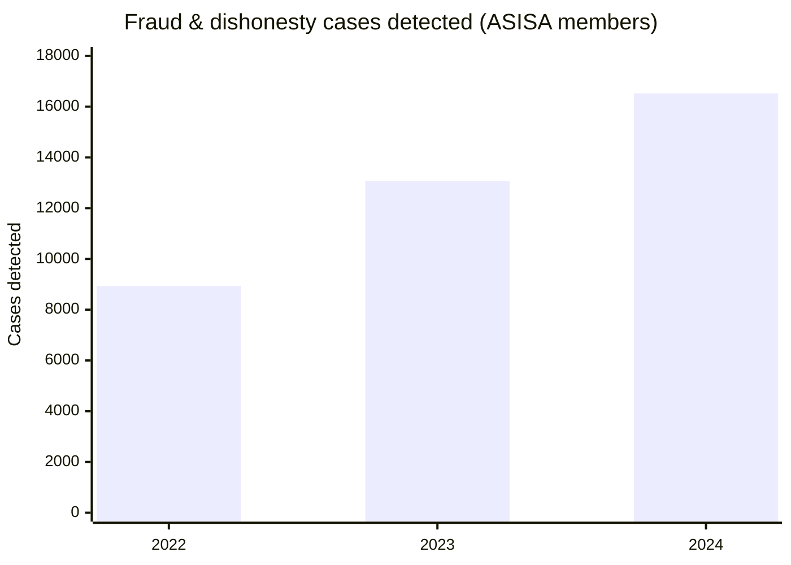
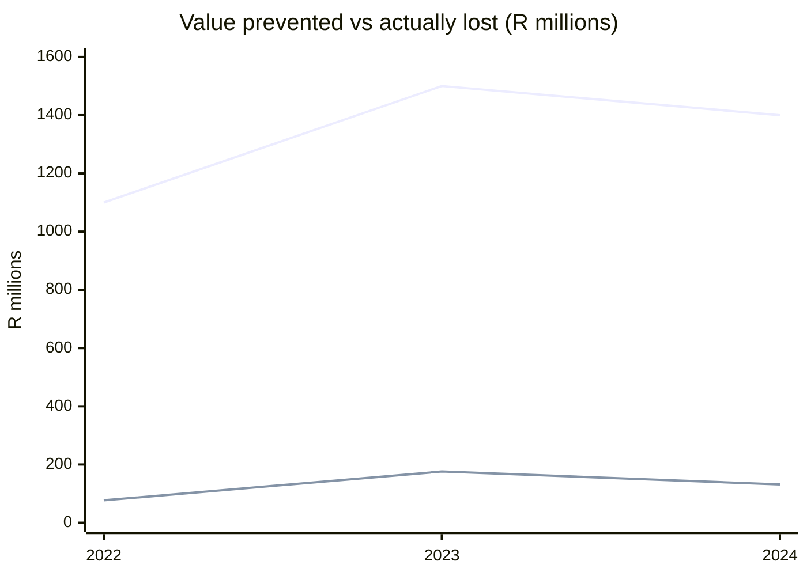
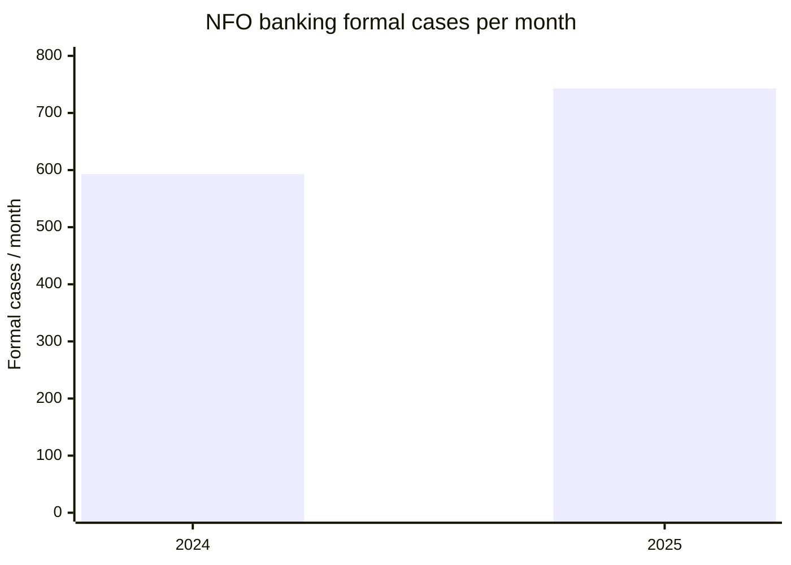
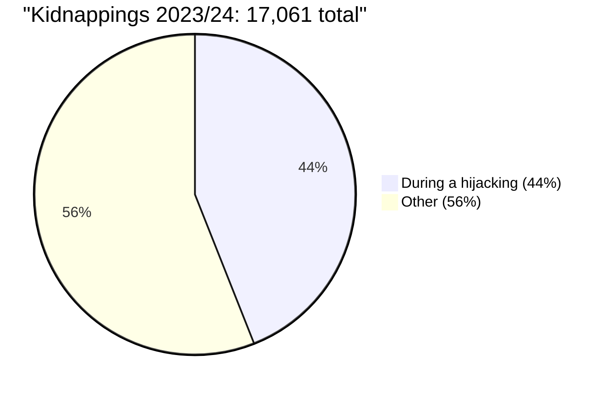

# VUKA — Problem: evidence and trends

> **Owner:** Babatunde Adelusi. **Status:** `PROPOSED` — the evidence annex to Block 1 of `docs/BUSINESS-CANVAS.md` and to `docs/PROBLEM-STATEMENT-SLIDES.md`. Uploaded to the submission platform alongside the canvas.
> **Method:** every figure is sourced to a primary or regulator/industry publication with a URL and date. Figures are tagged `FACT` (published as stated) · `ESTIMATE` (a stated derivation) · `ASSUMPTION` (believed, not sourced).
> **The one caveat that governs the whole document:** the evidence register is deliberately honest about what is **not** known. The size of the *coerced-transfer* problem specifically is not published by anyone, and we do not invent it.

---

## 1 · The core gap (the problem in one line)

**A coerced transfer authenticates exactly like a voluntary one, and no party holds a verifiable record of the coercion.**

- The victim is forced to unlock the phone and authorise the payment; the bank's record shows a completed, authenticated transfer. `FACT` (mechanism).
- Insurers verify coercion **after the fact** — bank statements, ATM footage and a sworn affidavit. `FACT` (iTOO, via FAnews, 19 Sep 2024).
- The ombud has held, in a reported express-kidnapping case, that a victim who surrendered credentials under duress had **no grounds to hold the bank liable**. `FACT` (NFO via FAnews, 19 Sep 2024).
- The ombud has also confirmed that **banks are not obliged to reverse transactions** on request. `FACT` (OBS 2022 Annual Report, via BusinessTech/The South African, 4 Jun 2023).

> **So what:** the only evidence that exists today is reconstructive and weak; the person who was coerced carries the burden of proving it.

---

## 2 · Insurer fraud is rising, not fading (the trend)

ASISA's Forensic Standing Committee has published detected fraud/dishonesty cases for life insurers and investment companies for three consecutive years.

| Year | Cases detected | Year-on-year | Value prevented | Actual losses |
|---|---:|---:|---:|---:|
| 2022 | **8,931** | — | R1.1bn | R77m |
| 2023 | **13,074** | **+46%** | R1.5bn | R175.9m |
| 2024 | **16,520** | **+26%** | R1.4bn | R131.6m |

`FACT` — ASISA media releases: "Fraud worth R1.1bn prevented … 2022"; "… report a 46% surge in fraud and dishonesty" (2023); "Fraud and dishonesty worth R1.4bn prevented … 2024". Corroborated by Daily Maverick (4 Dec 2023), Moneyweb and BusinessReport (2 Aug 2025).

**Reading it honestly — and pre-empting the insurer's objection:** ASISA stresses that the **R131.6m actually lost is only ~0.02% of honest claims** — detection on *known* fraud is working well. The gap VUKA addresses is the **undetected coerced transfer**, which is not in these numbers *because it is indistinguishable from a voluntary payment* and therefore cannot be counted. The rising case count shows fraud pressure is increasing; it does not measure the grey zone.

*Line 1 = value prevented; Line 2 = value actually lost.* `FACT` (ASISA).

**Industry-reported scale of fraud across all claims:** the Insurance Crime Bureau puts fraud at **5–12% of all insurance claims submitted** `FACT` ⚑ (ICB data — primary to confirm), and describes insurers as facing "billions in potential losses annually from fraudulent claims and organised crime" `FACT` (ICB Annual Report 2025). ICB's older short-term warning was **~R7bn in 2019, ≈20% of R35bn in claims paid** `ESTIMATE` (ICB, via Santam).

**Context for the insurer conversation:** South Africa's largest short-term insurer paid **R28.5bn in claims in 2025** `FACT` (Santam Integrated Report 2025) — the book our 5–12% range bites into.

---

## 3 · Banking disputes are rising too (the trend)

| Measure | Value | Tag | Source |
|---|---|---|---|
| Banking **formal** cases | 593.0/month (2024) → **742.83/month (2025)** — **+25.4%** | `FACT` | NFO Annual Report 2025 |
| Banking **premature** cases | 948.5 → 1,051.2/month (+11%) | `FACT` | NFO Annual Report 2025 |
| Fraud-related complaints | **nearly doubled** 2024 → 2025 | `FACT` | NFO via The Citizen, 16 Mar 2026 |
| Push-payment complaints | **+193** year-on-year | `FACT` | NFO (Maseti), via Moonstone, 16 Jul 2026 |
| Fraud complaint resolution | **~61 days** average | `FACT` | NFO via The Citizen, 16 Mar 2026 |
| Cost per formal case (system) | **R4,962.38** | `FACT` | OBS Annual Report 2024 (2023 data) |
| Ombud outcomes | only **17%** of banking/credit determinations in the complainant's favour | `FACT` | NFO AR, via Moonstone, 16 Jul 2026 |

> **So what:** the bank's dispute load is growing ~25% a year, it resolves slowly, it usually finds for the bank, and each escalated case costs the system ~R5,000.

---

## 4 · The scale of the crime around it

| Metric | Value | Tag | Source |
|---|---|---|---|
| Digital banking crime, 2025 | **R2.4bn** across **110,074** incidents — **all** digital banking crime, mostly social engineering, **not** coerced transfers | `FACT` | SABRIC 2025 (11 Aug 2026) |
| Kidnappings, 2023/24 | **17,061**, up 264% in a decade | `FACT` | SAPS via ISS, 3 Dec 2024 |
| Share during a hijacking | **44%** | `FACT` | SAPS via ISS, 3 Dec 2024 |
| Banking-app fraud avg loss | **R19,793–R21,836** per incident | `FACT` | iTOO published |
| Online-banking fraud avg loss | **R36,824–R37,197** per incident | `FACT` | iTOO published |
| Express-kidnapping cover sub-limit | **R50,000 / R100,000** | `FACT` | iTOO [My]Cylution |

> **Scope caveat (repeated on purpose):** SABRIC's R2.4bn is **not our market**. Coerced transfers are a subset of unknown size, bounded above by the kidnapping figures.

---

## 5 · The regulatory direction

| Item | Position | Tag | Source |
|---|---|---|---|
| Mandatory APP reimbursement, UK | In force from **7 Oct 2024**; cap **£85,000**/claim; sending bank reimburses, receiving bank contributes 50% | `FACT` | UK PSR, via Moonstone, 16 Jul 2026 |
| Mandatory APP reimbursement, SA | **None.** Authorised push-payment losses are generally treated as voluntary and borne by the consumer | `FACT` | World Payments Monitor, 8 Aug 2026 |
| National Treasury, Jun 2026 | Aware of the surge; notes the UK as a reference; "any potential policy response … would need to be carefully assessed" | `FACT` | BusinessReport, 26 Jun 2026 |
| Public pressure | A consumer-law firm's open letter and **petition** to the Finance Minister for mandatory reimbursement; no formal legislative process yet | `FACT` | Moonstone, 16 Jul 2026 |
| SARB direction | Draft **Fraud Risk Framework**; **Confirmation of Payee** work under the G20 Presidency; Directive 1 of 2024 & Joint Standard 2 of 2024 | `FACT` | SARB Annual Report 2025/26, payments chapter |

> **So what:** South Africa has **no** mandatory reimbursement today, so the bank's current cost is dispute handling and churn — but the question of who ultimately carries the loss is **open**, and moving.

---

## 6 · What is NOT known (and we say so)

| Unknown | Why it matters | What the pilot must measure |
|---|---|---|
| The number of coerced transfers per year | Sets the addressable size; no source publishes it | Count from the partnered insurer/bank's own book |
| Insurer's internal cost per coerced-transfer dispute | Proves the saving exceeds our price | Time-and-cost study of the partner's claim files |
| SA bank's internal cost per escalated dispute | The R4,962 is the *ombud's* system cost, not the bank's | The bank's own case cost |
| Frequency and severity of coerced-transfer claims | The actuary test's numerator | Frequency × severity from the partner's data |
| Whether SA will adopt mandatory reimbursement | Multiplies the bank's exposure if it does | Monitor FSCA / SARB / Treasury |

---

## 7 · Sources (URL + date)

- **ASISA**, "Fraud worth R1.1 billion prevented by life and investment companies in 2022" — asisa.org.za (Dec 2023).
- **ASISA**, "Life insurers and investment companies report a 46% surge in fraud and dishonesty" (2023 statistics) — asisa.org.za.
- **ASISA**, "Fraud and dishonesty worth R1.4 billion prevented by life insurers and investment companies in 2024" — asisa.org.za (2025).
- **BusinessReport**, "Asisa reports a rise in insurance fraud cases despite reduced losses" — 2 Aug 2025.
- **Daily Maverick**, "SA life insurers prevent R1.1bn worth of fraud in 2022" — 4 Dec 2023.
- **Moonstone**, "Asisa statistics reveal the main source of insurance policy fraud"; "Increase in cases of fraud and dishonesty detected by ASISA members"; "Law firm calls for banks to reimburse fraud victims" (16 Jul 2026).
- **The Citizen**, "Fraud complaints at the banking ombud nearly double in a year" — 16 Mar 2026.
- **Insurance Crime Bureau**, Annual Reports 2024 & 2025; "About us" (5–12% fraud range) — saicb.co.za.
- **NFO (National Financial Ombud Scheme)**, Annual Report 2025 — nfosa.co.za.
- **Ombudsman for Banking Services**, Annual Report 2024 (2023 data) — nationalgovernment.co.za.
- **SABRIC**, Annual Banking Crime Statistics 2025 — via `docs/EVIDENCE.md`.
- **SAPS via ISS Africa**, 3 Dec 2024.
- **iTOO Special Risks**, [My]Cylution product and incident-response pages; FAnews, 19 Sep 2024.
- **OBS**, 2022 Annual Report, via BusinessTech / The South African, 4 Jun 2023 (no reversal obligation).
- **UK PSR**, mandatory APP reimbursement (in force 7 Oct 2024).
- **World Payments Monitor**, South Africa jurisdiction — 8 Aug 2026.
- **SARB**, Annual Report 2025/26, payments chapter.
- **Santam**, Integrated Report 2025; **KPMG**, SA Insurance Industry Survey 2025.

*Figures marked `FACT` ⚑ are secondary-source at present and must be confirmed into `docs/EVIDENCE.md` (Khutso) before they appear on a judge-facing slide.*
