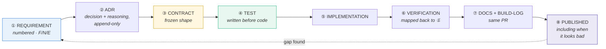
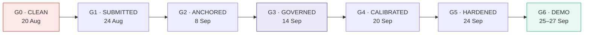
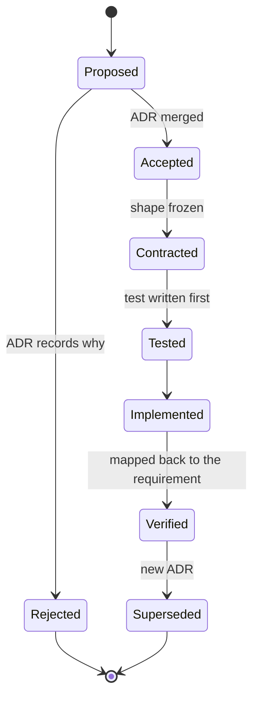

# VUKA — Software Development Life Cycle

### The process, the gates, the standards, and who signs what

| | |
|---|---|
| **Document** | `20-VUKA-SDLC.md` — the lifecycle |
| **Version** | 1.0 · 19 August 2026 |
| **Companions** | `19-VUKA-System-Architecture.md` (what we build) · `09-VUKA-SSDLC.md` (the five security boxes) · `21-VUKA-SDLC-Gap-Analysis.md` (what was missing) |
| **Authority** | `CLAUDE.md` is the master build context. Locked decisions D1–D16 win over this document until an ADR supersedes them |
| **Team** | Seven builders across four universities. Two joint leads; see `docs/TEAM.md` for the roster and ownership split |

---

## 0 · Why this document exists

A lifecycle document usually describes how a team *intends* to work. This one describes how a specific three-person team **actually works under a hard deadline**, which is a different and less flattering thing to write down.

Two facts shape every choice in here:

1. **A distributed team cannot run concurrent workstreams.** Anything that requires three parallel tracks of attention will fail on the first day someone has an exam or a job.
2. **The product's entire value is that it can be checked.** A process that lets a claim reach a slide without a test behind it does not just produce bad software — it destroys the one asset we cannot rebuild.

Everything below follows from those two sentences.

---

## 1 · The process model

### 1.1 Spec-driven, gate-sequenced

> **Numbered requirements → frozen contracts → implementation → verification mapped back to the requirement.**
> Nothing is built that no requirement asks for. Nothing is claimed that no test verifies.



Step ③ is the one that makes a distributed team viable. **Contracts freeze before implementation**, so nobody blocks on somebody else's design decision. Builder B can write the ingest endpoint while Builder A writes the client that calls it, because the shape between them was agreed and frozen first, and a contract test will catch either of them drifting.

Step ⑧ is the one that makes the product credible. A result that embarrasses us is published on the same path as one that flatters us — the forecast failing its baseline is in the repository, in the architecture document, and on the honesty slide.

### 1.2 Why not the obvious alternatives

| Model | Why not here |
|---|---|
| **Scrum / concurrent sprints** | Ceremony overhead is a fixed cost, and across four campuses it is a large fraction of capacity. Concurrent sprint tracks also assume you can absorb one track stalling. We cannot |
| **Waterfall** | The requirements genuinely changed — the ANCHOR layer is new this cycle. A model that treats change as failure would have forced us to pretend |
| **Pure Kanban** | No natural point at which the whole team stops and verifies. Our riskiest failure is a claim outrunning its evidence, and only a gate catches that |
| **Move fast and fix later** | The thing we would break is the reason anyone should believe us |

### 1.3 Sequenced phases, not parallel sprints

**One gate at a time, the whole team on it.** This is the single most important process decision in the document.



The cost is real and worth stating: **at any moment two builders are working outside their strongest area.** We accept that because the alternative — three isolated tracks — means three single points of knowledge, which is the actual killer in a small team. Working outside your speciality is how the other two learn enough to cover you.

---

## 2 · The gates — entry and exit criteria

A gate is not a date. **A gate is a set of exit criteria, and the date is when we find out whether we met them.**

### G0 · CLEAN — by 20 August

| | |
|---|---|
| **Entry** | Repository audit complete; findings enumerated |
| **Exit** | ① Three secrets rotated · ② reused password changed everywhere · ③ **git history purged**, not just HEAD · ④ secret scanning live as a **pre-commit hook AND a CI gate** · ⑤ third-party dataset removed from both public repositories · ⑥ risk layer re-based on public SAPS data only · ⑦ READMEs split into *Built* / *Designed, not built* · ⑧ junk artefacts deleted |
| **Blocking** | **Yes. No feature code is written until this gate closes.** These are live security and licensing exposures in public repositories |
| **Verification** | `gitleaks` clean on full history; a fresh clone contains no proprietary file; README claims cross-checked against `import` statements |

> **Exit criterion ⑦ is the one most likely to decide the hackathon.** Our entire position is that we can be checked. A README advertising six technologies that are not in the code is the first thing a judge reads, and it invalidates everything after it.

### G1 · SUBMITTED — by 24 August

| | |
|---|---|
| **Entry** | G0 closed |
| **Exit** | Deck covering the six mandated sections · Lean Canvas · SSDLC · team profiled on Sonke · this document set published |
| **Verification** | Every deck claim traced to a repository artefact or explicitly marked as a target |

### G2 · ANCHORED — by 8 September

| | |
|---|---|
| **Entry** | Contracts for F11, F12, F16 frozen; ADR-0021 accepted |
| **Exit** | Merkle batching · Ed25519 signing · public anchor live · verifier extended · `GET /v1/anchor/latest` returning a real root |
| **Verification** | An independent party verifies a root using a public OpenTimestamps verifier **with no cooperation from us**. Abuse case AB-6 passes |

### G3 · GOVERNED — by 14 September

| | |
|---|---|
| **Entry** | G2 closed; ADR-0022 and ADR-0023 accepted |
| **Exit** | Two-of-two signature gates · subject access endpoint · deletion route. **POPIA gap G-3 closed** |
| **Verification** | E8 invariant test green, **including that the rejected single-signature attempt is itself chained**. Chain still verifies after a deletion |

### G4 · CALIBRATED — by 20 September

| | |
|---|---|
| **Entry** | Real operating-distribution data available |
| **Exit** | Fusion weights fitted · reliability diagram and ECE published · forecast either beats its baseline **or is removed from the product** |
| **Verification** | `ml/eval/calibration.py` output committed. G-1 closed or restated with numbers |

### G5 · HARDENED — by 24 September

| | |
|---|---|
| **Entry** | G4 closed |
| **Exit** | SAST · DAST · dependency scan · abuse-case suite · ingest fuzzing · **bias evaluation run and published** |
| **Verification** | Findings triaged with severities; G-9 closed with a number, whichever way it comes out |

### G6 · DEMO — 25–27 September

| | |
|---|---|
| **Entry** | G5 closed |
| **Exit** | One-thread run-of-show rehearsed end to end · recorded fallback captured · every `sim_` component named aloud in the script |
| **Verification** | Full rehearsal on the demo topology, with the network deliberately cut once |

---

## 3 · Roles, RACI and the stated gap

### 3.1 Ownership

| Builder | Owns | Also |
|---|---|---|
| **A** — architecture, mobile, ML integration | `CLAUDE.md`, `docs/00-SPEC.md`, `app/`, `brain/`, model manifest | Pairs on ANCHOR signing |
| **B** — backend, systems, security | `server/`, `anchor/`, `shared/contract.ts`, CI, demo orchestration | **Nitpicks feasibility on every spec — flags anything infeasible TODAY, in an ADR proposal, not later** |
| **C** — data science, risk, business | `data/`, `ml/eval/`, business docs | The rand figures. Owns the forecast fix |

B's second column is a defined role, not a personality trait. **Someone must be paid, in status, to say "that cannot be built by Tuesday."** Without that role, optimistic specs survive until the week they are due.

### 3.2 RACI

| Activity | A | B | C |
|---|---|---|---|
| Requirements & spec | **R/A** | C | C |
| ADRs | R | R | R |
| Frozen contracts | **A** | **R** | C |
| Mobile & on-device | **R/A** | I | I |
| Server & API | C | **R/A** | I |
| ANCHOR layer | C | **R/A** | I |
| Fusion mathematics | **R** | C | **A** |
| Calibration & evaluation | C | I | **R/A** |
| Security & CI | I | **R/A** | I |
| Data pipeline & risk layer | I | C | **R/A** |
| Business case & rand figures | I | I | **R/A** |
| **Honesty ledger** | **R** | **R** | **R** |
| Demo orchestration | C | **R/A** | C |

The honesty ledger is R for everyone deliberately. **Any builder can stop a claim**, and none of them needs anyone else to agree.

### 3.3 ⚠️ The stated team gaps

The two gaps this section previously carried — no gender variety, and UI/UX shared rather than owned — are both closed. The team is now seven builders across four universities, with gender variety present and a dedicated frontend developer and security designer. They are replaced here rather than deleted, because a document that quietly drops its stated gaps is worth less than one that keeps a current list.

What is still real:

- **We have never built together in one room.** Seven people, four universities, coordinating remotely until 25 September. Integration risk concentrates on the first evening. Mitigation: everything coordinates through files in the repository — a per-person file, a shared append-only build log, frozen contracts — so no handover depends on anyone being reachable.
- **Mixed AI tooling across the team.** Claude Code, Codex, Cline, different models, no shared memory between them. Mitigation: `RULES.md` and `AGENTS.md` bind every person and every tool to the same standards and recording discipline.
- **UX is owned by a co-lead who also owns architecture.** Better than shared, still a single point of failure under load.

This is written down rather than smoothed over because a judge scoring team composition will see it in thirty seconds anyway, and the only thing worse than a gap is appearing not to have noticed it.

---

## 4 · Requirements management

| Class | Prefix | Meaning |
|---|---|---|
| Functional | **F** | Something the system does — F1…F18 |
| Non-functional | **N** | A budget it must meet — N1…N10 |
| **Ethical / refusal** | **E** | Something it must **never** do — E1…E10 |

The **E class is unusual and load-bearing.** Most projects hold their ethics in a values statement, where nothing can test them. Ours are numbered requirements with invariant tests in CI, which means a refusal can *fail a build*. A principle that cannot fail a build is a preference.

### Requirement lifecycle



**Rejected requirements keep their record.** ADR-0005 rejecting Dempster-Shafer and ADR-0024 recording the refused features are as valuable as the accepted ones — they are the evidence that a choice was made rather than defaulted into.

### Traceability

Every requirement carries: **decision → component → test → status**. The matrix lives in `19-VUKA-System-Architecture.md` §10.3 and is the single source of "is this actually built".

---

## 5 · Design practice

| Practice | Rule |
|---|---|
| **Constraint-first** | Start from what must never happen, not from what the technology can do |
| **Adversary-inclusive** | The threat model includes the insider **and the vendor**. If we are not on our own threat list, the design is naive |
| **Enforce at the lowest layer that can enforce** | Privacy lives in the vision layer, not in a policy document, so a policy change cannot silently weaken it |
| **Fuse only physically independent senses** | Mic, IMU, Bluetooth radio and camera are independent. Stacking models that read the same signal and multiplying their error rates is a discredited claim we keep in our own ledger |
| **Calibrated numbers only** | A raw softmax entering fusion is a **correctness bug**, not a style issue |
| **Disagreement is information** | High conflict K suppresses escalation and routes to verification. Never average disagreement away |
| **Graceful degradation is the architecture** | Every layer defines its behaviour when the layer above disappears. Stale data is marked stale, never blank and never invented |
| **Pure functions for shared logic** | `brain/` has no I/O, no clock, no platform calls — so one golden fixture is the referee for both web and native |

### Design review — what a reviewer asks

1. Which numbered requirement asks for this?
2. What must never happen here, and what stops it — code or documentation?
3. What happens when the layer above disappears?
4. Which number shown to a human is uncalibrated, and is it labelled?
5. Could a single operator do something consequential alone?
6. Does this create a new place where a person could be harmed by a machine's decision?

Question 5 exists because of a real finding: **a whitelisted entity accumulates no suspicion, and one operator could add one alone.** That is the highest-value insider attack in this product category, and it was found by asking question 5 rather than by a security tool.

---

## 6 · Implementation standards

### 6.1 Languages and tooling

| Area | Standard |
|---|---|
| `app/`, `dashboard/` | **TypeScript strict** |
| `server/`, `appliance/`, `anchor/`, `brain/`, `data/`, `ml/` | **Python 3.11+** with type hints, `ruff`, `black`, `pytest` |
| Commits | Conventional commits |
| Branches | `<name>/<thing>` |
| **Pull requests** | **For everything** — code, docs, design |

### 6.2 Definition of Ready

A ticket may start when it has: a numbered requirement · an accepted ADR if it changes a decision · a frozen contract if it crosses a boundary · a stated verification method · a named owner.

### 6.3 Definition of Done

- [ ] Tests written **before** the implementation, and passing
- [ ] Requirement ID referenced in the pull request
- [ ] Contract test asserts **exact shapes**, not status codes
- [ ] Invariant tests E1–E9 still green
- [ ] Documentation updated **in the same PR**
- [ ] `BUILD-LOG.md` entry appended
- [ ] No new uncalibrated number reaches a human unlabelled
- [ ] `sim_` prefix on anything simulated
- [ ] Secret scan clean

### 6.4 Rules that came from real bugs

| Rule | Origin |
|---|---|
| **Verify a model by loading the interpreter and reading `get_input_details()`. Do not trust recorded metadata** | July 2026. Recorded metadata disagreed with reality. Cost real hours |
| **The latency harness matches by ID** | A concurrent probe corrupted a measurement |
| **Canonical JSON with `sort_keys=True`** | Otherwise two correct implementations produce two different hashes, and verification by a stranger becomes impossible |

These are in the standards because they were paid for, not because they sounded rigorous.

---

## 7 · Security in the lifecycle

The five security boxes are detailed in `09-VUKA-SSDLC.md`. Their lifecycle placement:

| Phase | Security activity |
|---|---|
| Requirements | E-class refusal requirements written **as requirements**, not as values |
| Design | STRIDE per trust boundary; abuse cases AB-1…AB-12 defined **before** implementation |
| Implementation | Secret scanning pre-commit; strict schemas; no dynamic URL fetching anywhere |
| **Every commit** | **Secret scan is the first and blocking CI gate.** We committed secrets once — the control that prevents a repeat is mechanical, not cultural |
| Verification | Invariant tests; abuse-case suite; SAST, DAST, dependency scan at G5 |
| Release | Signed artefacts; model manifest sha256 verification |
| Operate | Evidence chain as the tamper-evident audit log; anchor liveness monitored |

> **The rule with no exceptions:** *we do not describe a remediation we have not performed.* Box 5 of the SSDLC discloses the secrets incident. It is only published once rotation, history purge and the pre-commit hook are genuinely in place. **Describing a fix you have not made is the one thing worse than the original finding.**

---

## 8 · Test strategy and quality assurance

> **Tests are the specification.** A regression is caught by a machine, not by the one person who remembers.

| Level | What it covers | Referee |
|---|---|---|
| Unit + golden fixtures | Fusion math, chain integrity, thresholds | `pytest`, shared fixture for web and native |
| Integration | ingest → score → chain → anchor | Test harness |
| **Contract** | **Exact request/response shapes** | Frozen contract |
| **Invariant (E1–E9)** | That a refused thing is **still refused** | CI, blocking |
| Abuse cases (AB-1…AB-12) | The adversary suite | CI at G5 |
| Evaluation | Calibration, false-alarm budget, forecast skill, bias | `ml/eval/`, `data/eval/` |
| Rehearsal | The demo, end to end, with the network cut once | Human |

**Mandatory-test areas** — a pull request touching any of these without tests does not merge: fusion mathematics · suspicion scoring · state-machine thresholds · chain integrity · API contracts · forecast evaluation · the human gate · dual signature · room isolation.

Full detail, including the traceability matrix and the invariant table, is in `19-VUKA-System-Architecture.md` Part X.

### Test data policy

| Rule | Reason |
|---|---|
| **No production personal data in any test environment.** Ever | POPIA, and because a test fixture is the least-guarded file in a repository |
| Synthetic or public data only | SAPS quarterly data is public domain |
| Fixtures carry `sim_` where they simulate a live component | D14 |
| A fixture that came from a person is a bug, not a shortcut | — |

---

## 9 · CI/CD

```mermaid
flowchart LR
    C["commit"] --> H["🔐 pre-commit<br/><i>secret scan · format</i>"]
    H --> PR["pull request"]
    PR --> S["🔐 secret scan<br/><b>blocking, first</b>"]
    S --> L["lint · types"]
    L --> U["unit + fixtures"]
    U --> CT["contract tests"]
    CT --> IV["<b>invariants E1…E9</b>"]
    IV --> AB["abuse cases"]
    AB --> AN["⛓ anchor liveness"]
    AN --> DOC["📄 docs + BUILD-LOG<br/><i>same PR or fail</i>"]
    DOC --> RV["👤 human review<br/><i>≥1 other builder</i>"]
    RV --> M["merge"]
    M --> REL["tag · sign · manifest"]
    style S fill:#fde8e8,stroke:#c0392b
    style IV fill:#ece9f7,stroke:#4a3aa7
    style DOC fill:#fff7e0,stroke:#d4a017
```



Two gates are unusual, both deliberate:

- **Secret scanning runs twice** — pre-commit *and* in CI. Pre-commit can be bypassed with `--no-verify`; the CI gate cannot. After G-6, one layer was not enough.
- **Docs-or-it-didn't-happen.** A behaviour change without a documentation update and a `BUILD-LOG` entry in the same pull request **fails the build**. Documentation drift is how a system stops being checkable, and for this product that is indistinguishable from failing.

### Branching and release

| | |
|---|---|
| Branches | `<name>/<thing>`, short-lived, off `main` |
| `main` | Always releasable. Protected. No direct pushes |
| Tags | Semantic version at each gate: `v0.2.0-G2`, `v0.3.0-G3`, … |
| Artefacts | Model files registered in a manifest with **sha256**; APK signed; server image tagged by commit |
| Rollback | Re-deploy the previous tag. **Chain data is never rolled back** — it is append-only, and a rollback of the ledger would be the exact thing the ledger prevents |

---

## 10 · Configuration and environments

| Environment | Purpose | Data | Anchoring |
|---|---|---|---|
| **local** | Development | Synthetic | Disabled or testnet |
| **demo** | The hackathon run | Seeded + `sim_` components | **Live, real roots** |
| **pilot** | One street, 2027 | Real, consented | Live |

Configuration rules:

- Secrets **never** in the repository. `.env` gitignored; **`.env.example` committed with no values**
- Configuration by environment variable, never by code branch
- **Feature flags may not gate a safety invariant.** There is no flag that turns off the human gate, the two-signature rule, or the privacy boundary. A flag that could disable a refusal would make the refusal a setting
- The demo runs on **localhost plus a tunnel regardless of cloud availability**. Cloud is a flex, never the decision path

---

## 11 · Deployment and operations runbook

### 11.1 Deploy

| Step | Check |
|---|---|
| 1 | CI green, including invariants |
| 2 | Model manifest sha256 verified **by loading the interpreter**, not by reading metadata |
| 3 | Migration applied (Alembic), reversible |
| 4 | Chain continuity confirmed across the deploy — `prev_hash` still links |
| 5 | Anchor liveness confirmed for the hour spanning the deploy |
| 6 | Smoke: ingest → score → chain → WS fan-out |

**Step 4 is specific to this system.** A deployment that broke the hash chain would be indistinguishable, to an outside verifier, from tampering. Continuity across a deploy is therefore a release criterion, not an afterthought.

### 11.2 Standing operational duties

| Cadence | Duty |
|---|---|
| Hourly (automated) | Merkle batch, anchor submit |
| Daily | Anchor liveness check; queue depth; failed-signature count |
| Weekly | False-alert rate per camera; alert acceptance rate by operator |
| Monthly | Retention TTL sweep; key rotation review; dependency scan |
| Per gate | Full abuse-case suite; open-gap register updated and republished |

### 11.3 Incident response

| Severity | Definition | Response |
|---|---|---|
| **SEV-1** | Chain integrity failure, key compromise, or personal data exposure | Immediate. Halt writes to the affected path. **Notify the Information Regulator and affected subjects per POPIA s22.** Publish |
| **SEV-2** | Anchor liveness gap > 3 hours; ingest outage | Same day. **Gap is published, never quietly backfilled** |
| **SEV-3** | Degraded modality, elevated false alerts | Next working day |
| **SEV-4** | Cosmetic, documentation | Next gate |

Every incident produces a written post-incident record with: what happened · what the evidence chain shows · what we changed · **what we told the people affected**. The last column is the one most incident templates omit and the one that matters to a member.

> **An anchor gap is published, not backfilled.** Backfilling would mean submitting a root later while implying it was timely — which is a false timestamp claim, made by the layer whose only job is honest timestamps.

### 11.4 Backup, disaster recovery, business continuity

| | Target | Note |
|---|---|---|
| **RPO** | ≤ 1 hour | Aligned to the anchor cadence, deliberately |
| **RTO** | ≤ 4 hours | Service restoration |
| Backups | Daily encrypted; monthly restore test | **A backup that has never been restored is a hypothesis** |
| **Chain recovery** | The chain is verifiable against **published anchors that we do not control**, so a restored copy can be *proved* correct rather than assumed correct | This is a genuine advantage of the design |
| Continuity | Every layer functions with the layer above gone. A total server loss degrades to local protection, not to no protection | §9.5 of the architecture |

---

## 12 · Change control

| Change | Requires |
|---|---|
| Ordinary code | PR + review by ≥ 1 other builder + CI green |
| **A locked decision D1–D16** | **ADR + both leads** |
| **A frozen contract** | **ADR + both leads** |
| Chain entry schema | ADR + all three. Additive only, forever |
| Fusion parameters | Versioned file; the version is recorded in the decision record |
| **Whitelist / camera disarm / threshold change / record deletion** | **Two-of-two operator signatures at runtime (D10). Not a process control — a code control** |

The last row is the difference between a policy and an architecture. Every other row in this table is enforced by people agreeing to follow it. **That row is enforced by the software refusing.**

---

## 13 · Maintenance, support and evolution

| Concern | Position |
|---|---|
| Bug triage | SEV scale above; safety-affecting bugs jump the queue regardless of size |
| Dependency updates | Monthly scan; security patches immediately; **major upgrades get an ADR** because they change what the system is built on |
| Model updates | New manifest entry, never in-place. **The fusion parameter version is recorded in every decision record, so any past decision can be reproduced with the parameters that produced it** |
| Deprecation | Path-versioned API; a `/v1` endpoint is not removed while any client depends on it |
| **Knowledge continuity** | Append-only ADRs; a PR for everything; tests as specification. **No single point of knowledge** — the real risk in a three-person team |
| End of life | See §16 |

---

## 14 · Documentation standards

| Document | Rule |
|---|---|
| `CLAUDE.md` | Master build context. Read first, every session |
| `docs/00-SPEC.md` | Numbered requirements, frozen contracts, verification map |
| **`docs/adr.md`** | **Append-only. Never edited — superseded** |
| **`docs/BUILD-LOG.md`** | **Append-only. Every behaviour change** |
| **`docs/OPEN-GAPS.md`** | **Public and current.** Disclosed so no judge has to discover them |
| `README.md` | **Split into *Built* and *Designed, not built*.** Non-negotiable |
| This document set | Architecture · SDLC · Gap analysis |

**Every status mark in every document is one of:** ✅ BUILT · 🔨 BUILDING · 📋 SPECIFIED · 🧪 SIMULATED · ⚠️ OPEN GAP · ❌ REFUSED · ⚑ estimate.

An unmarked claim is a defect, and it is reviewable as one.

---

## 15 · Metrics

### 15.1 Engineering health

| Metric | Target |
|---|---|
| PRs merged without a linked requirement | **0** |
| Behaviour changes without a docs update | **0** |
| Invariant test failures reaching `main` | **0** |
| Secret-scan findings | **0**, after G0 |
| Open gaps that are undisclosed | **0** — the register is the point |

### 15.2 Product

Detailed in `19-VUKA-System-Architecture.md` §11.5. The headline four:

| Metric | Why this one |
|---|---|
| **Decisions made by a machine about a person** | Target **0**. A hard zero, tested by E1 |
| **Hours anchored** | Target **100 %**. Zero error budget; a miss is published |
| Detection → alert render p95 | ≤ 2 000 ms; currently 318 ms ⚠️ n=10 |
| Median time to a **named human** decision | The system's actual promise |

---

## 16 · Sustainability and end of life

| Horizon | Position |
|---|---|
| **Cost** | Anchoring is **fixed at ~R0/month for the whole network at any size** (OpenTimestamps primary; Hedera ~R9–10 fallback, corrected 17 Sep) (D9). The verifiability can never become an economic casualty of growth |
| **Operations** | Edge-first compute; no video streaming by default; retention TTLs cap storage growth |
| **Knowledge** | Append-only decision record; a PR for everything |
| **If the company fails** | **Published anchor roots remain verifiable using public tools, with no cooperation from us.** A member's proof survives our death. This is a direct consequence of D8 and D11 |
| **Decommissioning** | Personal data deleted per the retention schedule; hashes retained so historical records stay verifiable; the final root published; the verifier released so anyone can still check the past |
| **Environmental** | Real: edge inference, no default video streaming. Honest: **we do not claim Bitcoin is green** — we claim our marginal contribution is one hash inside a transaction that was happening anyway |

---

## 17 · Templates

### 17.1 ADR

```markdown
# ADR-00NN — <decision in one line>

**Status:** Proposed | Accepted | Superseded by ADR-00MM
**Date:** YYYY-MM-DD   **Deciders:** A, B, C

## Context
What forced a decision. Include the constraint, not just the goal.

## Options considered
| Option | Cost | Why not |

## Decision
What we chose.

## Consequences
What this makes harder. **Required — an ADR with no cost is not a decision.**

## Verification
Which test proves this is still true.
```

### 17.2 Pull request

```markdown
**Requirement:** F## / N## / E##
**ADR:** if a decision changed
**Contract:** unchanged | changed (needs all three signatures)

## What changed
## How it was verified
## Docs updated
- [ ] Doc page
- [ ] BUILD-LOG entry
- [ ] OPEN-GAPS updated if this opened or closed a gap

## Honesty check
- [ ] No new uncalibrated number reaches a human unlabelled
- [ ] `sim_` prefix on anything simulated
- [ ] No claim added that a test does not support
```

### 17.3 Incident record

```markdown
# INC-YYYY-NN — <title>
**Severity:** SEV-#   **Detected:** ts   **Resolved:** ts

## What happened
## What the evidence chain shows
## Impact — who, and what data
## What we changed
## What we told the people affected     ← required
## Whether this is now a gap on the register
```

### 17.4 Model card

```markdown
# Model — <name> <version>
**sha256:** …          **Size:** … MB       **Quantisation:** INT8
**Source:** pretrained | fine-tuned | trained by us   ← state plainly
**Input shape (from `get_input_details()`):** …   ← read from the interpreter, not from metadata
**Intended use:** …
**Out of scope:** …
**Known limitations / demographic performance:** …   ← "not measured" is a valid and required answer
**Calibrated:** yes | no. If no, every number it produces is labelled a target
**Where it sits in the decision path:** perception only | never in a determination about a person
```

---

## 18 · The three rules, if you remember nothing else

1. **A claim without a test is a defect.** Not a rough edge — a defect, reviewable as one.
2. **Documentation ships in the same pull request as the behaviour.** Otherwise the system stops being checkable, which for this product is the same as failing.
3. **We publish the numbers that embarrass us.** It is the only reason anyone should believe the ones that don't.

---

*VUKA — VIGIL · UMOJA · KHAYA · ANCHOR*
*`20-VUKA-SDLC.md` · v1.0 · 19 August 2026*
